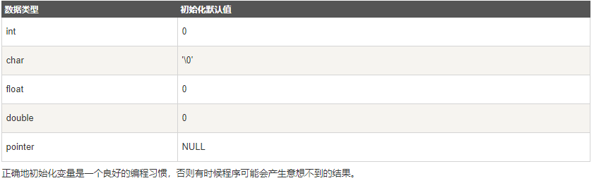

### 局部变量

在函数或一个代码块内部声明的变量，称为局部变量。它们只能被函数内部或者代码块内部的语句使用。

```c++
#include <iostream>
using namespace std;
 
int main ()
{
  // 局部变量声明
  int a, b;
  int c;
 
  // 实际初始化
  a = 10;
  b = 20;
  c = a + b;
 
  cout << c;
 
  return 0;
}
```

### 全局变量

在所有函数外部定义的变量（通常是在程序的头部），称为全局变量。全局变量的值在程序的整个生命周期内都是有效的。
全局变量可以被任何函数访问。也就是说，全局变量一旦声明，在整个程序中都是可用的。

```c++
#include <iostream>
using namespace std;
 
// 全局变量声明
int g;
 
int main ()
{
  // 局部变量声明
  int a, b;
 
  // 实际初始化
  a = 10;
  b = 20;
  g = a + b;
 
  cout << g;
 
  return 0;
}
```

在程序中，局部变量和全局变量的名称可以相同，但是在函数内，局部变量的值会覆盖全局变量的值。

```c++
#include <iostream>
using namespace std;
 
// 全局变量声明
int g = 20;
 
int main ()
{
  // 局部变量声明
  int g = 10;
 
  cout << g;
 
  return 0;
}
```
当上面的代码被编译和执行时，它会产生下列结果：

```c++
10
```

### 初始化局部变量和全局变量

当局部变量被定义时，系统不会对其初始化，您必须自行对其初始化。

定义全局变量时，系统会自动初始化为下列值：



