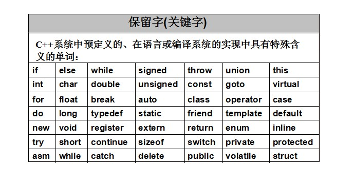
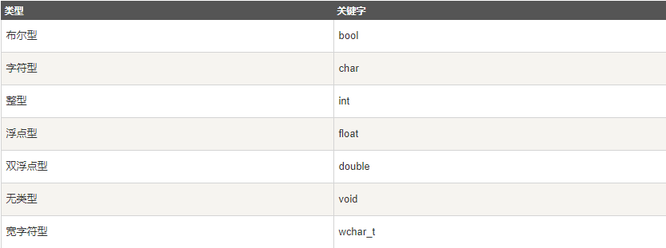
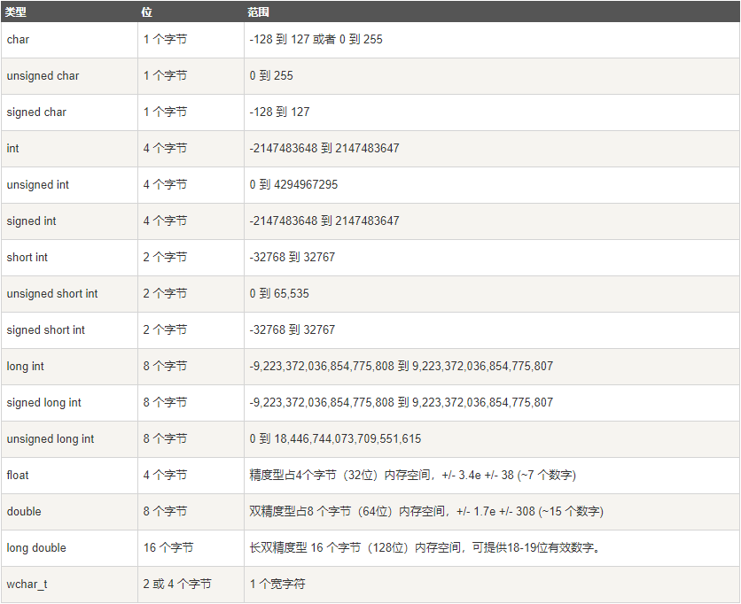

### C++ 程序结构

让我们看一段简单的代码，可以输出单词 Hello World。

```c++
#include <iostream>
using namespace std;
 
// main() 是程序开始执行的地方
 
int main()
{
   cout << "Hello World"; // 输出 Hello World
   return 0;
}
```

接下来我们讲解一下上面这段程序：

- C++ 语言定义了一些头文件，这些头文件包含了程序中必需的或有用的信息。上面这段程序中，包含了头文件 <iostream>。
- 下一行 using namespace std; 告诉编译器使用 std 命名空间。命名空间是 C++ 中一个相对新的概念。
- 下一行 // main() 是程序开始执行的地方 是一个单行注释。单行注释以 // 开头，在行末结束。
- 下一行 int main() 是主函数，程序从这里开始执行。
- 下一行 cout << "Hello World"; 会在屏幕上显示消息 "Hello World"。
- 下一行 return 0; 终止 main( )函数，并向调用进程返回值 0。

### 编译 & 执行 C++ 程序

接下来让我们看看如何把源代码保存在一个文件中，以及如何编译并运行它。下面是简单的步骤：

- 打开一个文本编辑器，添加上述代码。
- 保存文件为 hello.cpp。
- 打开命令提示符，进入到保存文件所在的目录。
- 键入 'g++ hello.cpp '，输入回车，编译代码。如果代码中没有错误，命令提示符会跳到下一行，并生成 a.out 可执行文件。
- 现在，键入 ' a.out' 来运行程序。
- 您可以看到屏幕上显示 ' Hello World '。

```
$ g++ hello.cpp
$ ./a.out
Hello World
```

请确保您的路径中已包含 g++ 编译器，并确保在包含源文件 hello.cpp 的目录中运行它。

您也可以使用 makefile 来编译 C/C++ 程序。

### C++ 中的分号 & 语句块

在 C++ 中，分号是语句结束符。也就是说，每个语句必须以分号结束。它表明一个逻辑实体的结束。

例如，下面是三个不同的语句：

```c++
x = y;
y = y + 1;
add(x, y);
```

语句块是一组使用大括号括起来的按逻辑连接的语句。例如：

```c++
{
   cout << "Hello World"; // 输出 Hello World
   return 0;
}
```

C++ 不以行末作为结束符的标识，因此，您可以在一行上放置多个语句。例如：
```c++
x = y;
y = y + 1;
add(x, y);
```
等同于

```c++
x = y; y = y + 1; add(x, y);
```

### C++ 关键字

下表列出了 C++ 中的保留字。这些保留字不能作为常量名、变量名或其他标识符名称。


	 

完整关键字介绍可查阅：<https://www.runoob.com/w3cnote/cpp-keyword-intro.html>

### C++ 中的空格

只包含空格的行，被称为空白行，可能带有注释，C++ 编译器会完全忽略它。

在 C++ 中，空格用于描述空白符、制表符、换行符和注释。空格分隔语句的各个部分，让编译器能识别语句中的某个元素（比如 int）在哪里结束，下一个元素在哪里开始。因此，在下面的语句中：

```c++
int age;
```

在这里，int 和 age 之间必须至少有一个空格字符（通常是一个空白符），这样编译器才能够区分它们。另一方面，在下面的语句中：

```c++
fruit = apples + oranges;   // 获取水果的总数
```
fruit 和 =，或者 = 和 apples 之间的空格字符不是必需的，但是为了增强可读性，您可以根据需要适当增加一些空格。

### C++ 注释

- 单行注释： //
- 多行注释：
```c++
/* 这是注释 */
 
/* C++ 注释也可以
 * 跨行
 */
```

### C++ 数据类型

#### 基本的内置类型



其实 wchar_t 是这样来的：

```c++
typedef short int wchar_t;
```

所以 wchar_t 实际上的空间是和 short int 一样。

一些基本类型可以使用一个或多个类型修饰符进行修饰：

- signed
- unsigned
- short
- long

下表显示了各种变量类型在内存中存储值时需要占用的内存，以及该类型的变量所能存储的最大值和最小值。

!!! notice
	不同系统会有所差异，一字节为 8 位。

!!! notice
	long int 与 int 都是 4 个字节，因为早期的 C 编译器定义了 long int 占用 4 个字节，int 占用 2 个字节，新版的C/C++ 标准兼容了早期的这一设定。



从上表可得知，变量的大小会根据编译器和所使用的电脑而有所不同。

下面实例会输出您电脑上各种数据类型的大小。

```c++
// data_type

#include<iostream>  
#include <limits>
 
using namespace std;  
  
int main()  
{  
    cout << "type: \t\t" << "************size**************"<< endl;  
    cout << "bool: \t\t" << "所占字节数：" << sizeof(bool);  
    cout << "\t最大值：" << (numeric_limits<bool>::max)();  
    cout << "\t\t最小值：" << (numeric_limits<bool>::min)() << endl;  
    cout << "char: \t\t" << "所占字节数：" << sizeof(char);  
    cout << "\t最大值：" << (numeric_limits<char>::max)();  
    cout << "\t\t最小值：" << (numeric_limits<char>::min)() << endl;  
    cout << "signed char: \t" << "所占字节数：" << sizeof(signed char);  
    cout << "\t最大值：" << (numeric_limits<signed char>::max)();  
    cout << "\t\t最小值：" << (numeric_limits<signed char>::min)() << endl;  
    cout << "unsigned char: \t" << "所占字节数：" << sizeof(unsigned char);  
    cout << "\t最大值：" << (numeric_limits<unsigned char>::max)();  
    cout << "\t\t最小值：" << (numeric_limits<unsigned char>::min)() << endl;  
    cout << "wchar_t: \t" << "所占字节数：" << sizeof(wchar_t);  
    cout << "\t最大值：" << (numeric_limits<wchar_t>::max)();  
    cout << "\t\t最小值：" << (numeric_limits<wchar_t>::min)() << endl;  
    cout << "short: \t\t" << "所占字节数：" << sizeof(short);  
    cout << "\t最大值：" << (numeric_limits<short>::max)();  
    cout << "\t\t最小值：" << (numeric_limits<short>::min)() << endl;  
    cout << "int: \t\t" << "所占字节数：" << sizeof(int);  
    cout << "\t最大值：" << (numeric_limits<int>::max)();  
    cout << "\t最小值：" << (numeric_limits<int>::min)() << endl;  
    cout << "unsigned: \t" << "所占字节数：" << sizeof(unsigned);  
    cout << "\t最大值：" << (numeric_limits<unsigned>::max)();  
    cout << "\t最小值：" << (numeric_limits<unsigned>::min)() << endl;  
    cout << "long: \t\t" << "所占字节数：" << sizeof(long);  
    cout << "\t最大值：" << (numeric_limits<long>::max)();  
    cout << "\t最小值：" << (numeric_limits<long>::min)() << endl;  
    cout << "unsigned long: \t" << "所占字节数：" << sizeof(unsigned long);  
    cout << "\t最大值：" << (numeric_limits<unsigned long>::max)();  
    cout << "\t最小值：" << (numeric_limits<unsigned long>::min)() << endl;  
    cout << "double: \t" << "所占字节数：" << sizeof(double);  
    cout << "\t最大值：" << (numeric_limits<double>::max)();  
    cout << "\t最小值：" << (numeric_limits<double>::min)() << endl;  
    cout << "long double: \t" << "所占字节数：" << sizeof(long double);  
    cout << "\t最大值：" << (numeric_limits<long double>::max)();  
    cout << "\t最小值：" << (numeric_limits<long double>::min)() << endl;  
    cout << "float: \t\t" << "所占字节数：" << sizeof(float);  
    cout << "\t最大值：" << (numeric_limits<float>::max)();  
    cout << "\t最小值：" << (numeric_limits<float>::min)() << endl;  
    cout << "size_t: \t" << "所占字节数：" << sizeof(size_t);  
    cout << "\t最大值：" << (numeric_limits<size_t>::max)();  
    cout << "\t最小值：" << (numeric_limits<size_t>::min)() << endl;  
    cout << "string: \t" << "所占字节数：" << sizeof(string) << endl;  
    // << "\t最大值：" << (numeric_limits<string>::max)() << "\t最小值：" << (numeric_limits<string>::min)() << endl;  
    cout << "type: \t\t" << "************size**************"<< endl;  
    return 0;  
}
```

本实例使用了 endl，这将在每一行后插入一个换行符，<< 运算符用于向屏幕传多个值。我们也使用 sizeof() 函数来获取各种数据类型的大小。

#### typedef 声明

您可以使用 typedef 为一个已有的类型取一个新的名字。下面是使用 typedef 定义一个新类型的语法：
```c++
typedef type newname; 
```
例如，下面的语句会告诉编译器，feet 是 int 的另一个名称：
```c++
typedef int feet;
```
现在，下面的声明是完全合法的，它创建了一个整型变量 distance：
```c++
feet distance;
```

#### 枚举类型

枚举类型(enumeration)是C++中的一种派生数据类型，它是由用户定义的若干枚举常量的集合。

如果一个变量只有几种可能的值，可以定义为枚举(enumeration)类型。所谓"枚举"是指将变量的值一一列举出来，变量的值只能在列举出来的值的范围内。

创建枚举，需要使用关键字 enum。枚举类型的一般形式为：

```c++
enum 枚举名{ 
     标识符[=整型常数], 
     标识符[=整型常数], 
... 
    标识符[=整型常数]
} 枚举变量;
```

如果枚举没有初始化, 即省掉"=整型常数"时, 则从第一个标识符开始。

例如，下面的代码定义了一个颜色枚举，变量 c 的类型为 color。最后，c 被赋值为 "blue"。
```c++
enum color { red, green, blue } c;
c = blue;
```

默认情况下，第一个名称的值为 0，第二个名称的值为 1，第三个名称的值为 2，以此类推。但是，您也可以给名称赋予一个特殊的值，只需要添加一个初始值即可。例如，在下面的枚举中，green 的值为 5。
```c++
enum color { red, green=5, blue };
```

在这里，blue 的值为 6，因为默认情况下，每个名称都会比它前面一个名称大 1，但 red 的值依然为 0。

### C++ 变量类型


#### C++ 中的变量定义

变量定义就是告诉编译器在何处创建变量的存储，以及如何创建变量的存储。变量定义指定一个数据类型，并包含了该类型的一个或多个变量的列表，如下所示：

type variable_list;

在这里，type 必须是一个有效的 C++ 数据类型，可以是 char、wchar_t、int、float、double、bool 或任何用户自定义的对象，variable_list 可以由一个或多个标识符名称组成，多个标识符之间用逗号分隔。下面列出几个有效的声明：

```c++
int    i, j, k;
char   c, ch;
float  f, salary;
double d;
```

行 int i, j, k; 声明并定义了变量 i、j 和 k，这指示编译器创建类型为 int 的名为 i、j、k 的变量。

变量可以在声明的时候被初始化（指定一个初始值）。初始化器由一个等号，后跟一个常量表达式组成，如下所示：

type variable_name = value;

下面列举几个实例：

```c++
extern int d = 3, f = 5;    // d 和 f 的声明 
int d = 3, f = 5;           // 定义并初始化 d 和 f
byte z = 22;                // 定义并初始化 z
char x = 'x';               // 变量 x 的值为 'x'
```
不带初始化的定义：带有静态存储持续时间的变量会被隐式初始化为 NULL（所有字节的值都是 0），其他所有变量的初始值是未定义的。

#### C++ 中的变量声明

变量声明向编译器保证变量以给定的类型和名称存在，这样编译器在不需要知道变量完整细节的情况下也能继续进一步的编译。变量声明只在编译时有它的意义，在程序连接时编译器需要实际的变量声明。

当您使用多个文件且只在其中一个文件中定义变量时（定义变量的文件在程序连接时是可用的），变量声明就显得非常有用。您可以使用 `extern` 关键字在任何地方声明一个变量。虽然您可以在 C++ 程序中多次声明一个变量，但变量只能在某个文件、函数或代码块中被定义一次。

尝试下面的实例，其中，变量在头部就已经被声明，但它们是在主函数内被定义和初始化的：

```c++
#include <iostream>
using namespace std;
 
// 变量声明
extern int a, b;
extern int c;
extern float f;
  
int main ()
{
  // 变量定义
  int a, b;
  int c;
  float f;
 
  // 实际初始化
  a = 10;
  b = 20;
  c = a + b;
 
  cout << c << endl ;
 
  f = 70.0/3.0;
  cout << f << endl ;
 
  return 0;
}
```

同样的，在函数声明时，提供一个函数名，而函数的实际定义则可以在任何地方进行。例如：

```c++
// 函数声明
int func();
 
int main()
{
    // 函数调用
    int i = func();
}
 
// 函数定义
int func()
{
    return 0;
}
```

#### C++ 中的左值（Lvalues）和右值（Rvalues）

C++ 中有两种类型的表达式：

- 左值（lvalue）：指向内存位置的表达式被称为左值（lvalue）表达式。左值可以出现在赋值号的左边或右边。
- 右值（rvalue）：术语右值（rvalue）指的是存储在内存中某些地址的数值。右值是不能对其进行赋值的表达式，也就是说，右值可以出现在赋值号的右边，但不能出现在赋值号的左边。

变量是左值，因此可以出现在赋值号的左边。数值型的字面值是右值，因此不能被赋值，不能出现在赋值号的左边。下面是一个有效的语句：

```c++
int g = 20;
```
但是下面这个就不是一个有效的语句，会生成编译时错误：

```c++
10 = 20;
```