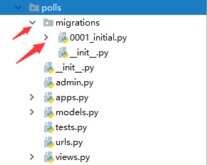
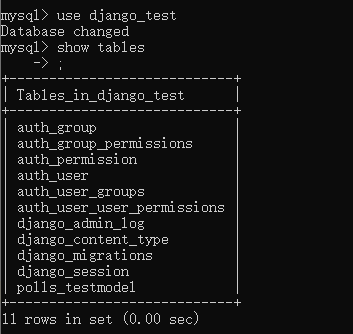

# Django中的模型

## ORM

 对象关系映射（Object Relational Mapping）：通过使用描述对象和数据库之间映射的元数据，将面向对象语言程序中的对象自动持久化到关系数据库中。

映射关系

| model  | db     |
| ------ | ------ |
| 实体类 | 表名   |
| 类属性 | 表字段 |
| 类实例 | 表记录 |

## 数据库配置

在`setting.py`中配置数据库信息

```python
DATABASES = {
    'default': {
        'ENGINE': 'django.db.backends.mysql',
        'NAME': 'db_name',
        'USER': 'root',
        'PASSWORD': '123456',
        'HOST': '127.0.0.1',
        'PORT': 3306,
    }
}
```

参数说明：

`ENGINE`： 

```
# 可选值有，分别对应不同的数据库
django.db.backends.sqlite3
django.db.backends.postgresql
django.db.backends.mysql
django.db.backends.oracle
```

`NAME`：数据库的名称。如果使用的是 SQLite，数据库将是你电脑上的一个文件，在这种情况下， NAME 应该是此文件的绝对路径，包括文件名。

如果你不使用 SQLite，则必须添加一些额外设置，比如 USER 、 PASSWORD 、 HOST 等等。

 想了解更多数据库设置方面的内容，请看文档：[`DATABASES`](https://docs.djangoproject.com/zh-hans/2.2/ref/settings/#std:setting-DATABASES) 

## 创建模型

语法：

```python
class ModelName(models.Model):
	属性名 = models.字段类型(字段选项)
```

字段类型:  

​															分别对应数据库中的数据类型

```python
CharField()                 varchar()
EmailField()				varchar()
URLField()					varchar()
ImageField()				varchar()	
IntegerField()				int
FloatField()				float
DecimalField()				decimal
BolleanField()				boolean
DateField()					data
DateTimeField()				datetime
TextField()					text
```
字段选项:

```
1. default
2. null: True 或 False
3. db_column: 指定列名
4. db_index: True 或 False 创建索引
5. max_length: 最大长度
```

```python
# models.py  
from django.db import models
from django.db.models import CharField

class TestModel(models.Model):
    name = CharField(max_length=50)
```

## 创建好模型之后需要同步数据库

```python
# 1. 将models.py中的内容生成中间文件
python manage.py makemigrations

# 2. 将中间文件映射到数据库中
python manage.py migrate
```

执行完第一条之后会发现应用目录下多了一个中间文件。(遇到问题可以看这篇文章： https://kongping.net/blog/post/5538/ )



此时只是生成了中间文件，数据库中是没有表的（因为还没有同步到数据库）

执行第二条语句：python manage.py migrate

成功同步到数据库中，看下图。



tips: 每次修改模型都要同步一下！

### 版本的切换指令

 0001-initial.py

 0002-xxxx.py

 0003-xxxx.py

 python manage.py migrate 应用的名称 版本号

##  模型中的CRUD (create read update delete)

###  增加数据 create

1. Entry.objects.create(属性=值，属性=值)

   返回值

   ​	插入成功：返回创建好的实体对象

   ​	插入失败：返回None，产生异常

2. 创建一个Entry对象，并通过save()进行保存

   obj = Entry(属性=值, 属性=值)

   obj.属性 = 值

   obj.save()

   无返回值，保存成功后，obj会被重新赋值**(obj多了一个id属性)**

   ```python
   def index_view(request):
       obj = TestModel()
       obj.name = 'xxx'
       print(obj.id)
   
       obj.save()
       print(obj.id)
       return HttpResponse('index')
       
   # 执行结果
   None
   1
   ```

### 查询数据 read

通过Entry.objects 调用查询接口函数

Entry.objects 提供了对该实体的所有的数据的查询

1. 获取所有查询结果的方法

   方法：`all()`

   ```python
   Enrty.objects.all()
   ```

   返回：QuerySet(查询结果集，本质是一个封装了若干对象的列表)

2. 查询返回指定列

   方法：`values()` 或 `values('列名1', '列名2')`

   作用： 查询表中数据的部分列，封装到字典中，再封装到QuerySet中 

   返回：QuerySet(查询结果集，本质是一个封装了若干字段的列表)

3. 查询返回指定列

   方法: ` values_list() `

   作用：将数据封装到元组中再封装到列表中

4. 排序方法

   方法：` order_by() `

   语法：

   ```
   Entry.objects.order_by('col1', '-col2')
   ```

   默认是升序排序，列名前加-，则表示降序排序

5. 查询只返回一条数据

   方法：` get(条件) `

   返回：单个实体对象

   注意：

   ​	该方法只使用于只能查询出一条结果的场合
   ​    如果查询多于一条数据或没查询出结果都会抛出异常

6. 根据条件查询部分行

   方法：` filter(条件) `

   返回： QuerySet 

   ```python
   # 查询Author实体中id=1的信息
   authors = Author.objects.filter(id=1)
   ```

   **非等值条件需要使用查询谓词 Field Lookup** 

   语法：

   ​	Entry.objects.filter(属性__查询谓词=值)

   注意：

   ```python
   # 每个查询谓词都是一个独立的功能条件
       __exact: 等值条件判断
       __gt: 大于条件判断
       __year: 得到日期中的年份再进一步判断
       __contains: 模糊查询'%xxx%'
       __range: 模糊查询 between add
       ... ...
   # 所有支持条件查询的位置处都支持查询谓词
   	filter() get() exclude()
   ```

   

7. 对条件取反

   方法：` exclude(条件) `

   ```python
   Author.objects.exclude(id=1)
   select * from author where not(id=1)
   ```

   

8. 聚合查询（不带分组）

   方法：` aggregate(列名=聚合函数('列')) `

   ```python
   Author.objects.aggregate(sumAge=Avg('age'))
   ```

   聚合函数:

     1. Avg(): 平均值
           2. Count(): 数量
               3. Sum(): 求和
                   4. Min(): 求最小值
                       5. Max(): 求最大值

9. 聚合查询（带分组）

   方法：` nnotate(名字=聚合函数('列')) `

   ```python
   # 按id分组查询平均年龄
   Author.objects.values('id').annotate(avg_age=Avg('age'))
   
   集结 where，分组查询，having 于一体的查询接口
       Author.objects
       .filter(id__gte=3)  # where子句
       .values('age')  # group by
       .annotate(avgAge=Avg('age'))  # 查询聚合函数
       .filter(avgAge__gte>20)  # having子句
       .order_by('')  # 子句
   ```

   

所有的查询接口函数都可以通过query属性来得到对应的sql语句

```
例如： Entry.objects.all().query
```

###  修改数据 update

1. 修改单个实体 

   ```python
   # 查， 改， 保存 
   obj = TestModel.objects.filter(id=1).first()
   obj.name = 'wwww'
   obj.save()
   ```

2. 批量修改数据

   ```python
   # 调用QuerySet的update(属性=值, 属性=值)实现批量修改 
   objs = TestModel.objects.all()
   objs.update(name='xxx')
   ```

###  删除数据 delete

调用实体对象或查询结果集的delete()方法来完成删除

1.  删除单个对象 

   ```python
   au = Author.objects.get(id=1)
   au.delete()
   ```

2.  批量删除 

   ```python
   Author.objects.all().delete()
   ```

## F查询  Q查询 

### F():

作用：在执行过程中获取某列的值

语法：

​		   from django.db.models import F
​           F('列名'): 得到某列的值

```python
# 把所有的Author的age增加10
Author.objects.all().update(age=F('age')+10)
```

###  Q()

作用：在查询条件中可以完成or操作

语法：

​		   from django.db.models import Q
​           Q(条件1)|Q(条件2)

```python
# 查询id>=3 或 年龄小于60的信息
authors = Author.objects.filter(Q(id__gte=3)|Q(age__lt=60)).all()
```

## 原生的数据库操作方法

1. 查询

   ```python
   Entry.objects.raw(sql)
   ```

   返回值:QuerySet()

2. 增删改

   ```python
   from django.db import connection
   def do_sql(request):
       with connection.curso() as cursor:
           sql = '...';
           cursor.execute(sql)  # 影响的行数
           return xx
   ```


## 自定义查询对象 - objects

objects 的 属性的类型为 models.Manager

1. 声明 EntryManager 类，继承自models.Manager, 允许在 EntryManager 中增加自定义函数

   ```python
   class EntryManager(models.Manager):
       def 函数名(self):
           ... ...
           return ...
   ```

2. 使用给EntryManager 覆盖Models类中覆盖原有的objects

   ```python
   class Entry(models.Model):
   	objects = EntryManager()
   ```

   