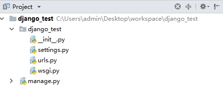
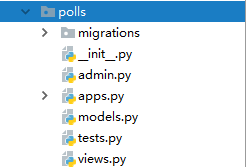

# 1. django介绍及安装  

##### 1.1 版本介绍

| 框架介绍 |                                                          |
| -------- | :------------------------------------------------------- |
|          | Django是一个开源框架，2005年开发，采用python语言编写的。 |
|          | 早期是主要做新闻和内容管理的网站                         |
|          | Django本身提供了非常强大的后台管理系统                   |
| 官网     | http://www.djangoproject.com                             |
| 中文文档 | http://djangobook.py3k.cn/2.0/                           |

##### 版本路线图


横轴代表发行年份。

 ***LTS***是长期支持(Long Term Support)的缩写 ，选用django开发时，一般选用长期支持版。

django1.8  2019年就不再支持维护了。

django1.11 2021年 不再支持维护。

笔者学习的时候使用的是django1.11版，现在推荐使用的是django2.2 以后版本。


## 框架模式

| MTV  |                          |
| ---- | ------------------------ |
| M    | Models - 模型（数据库）  |
| T    | Templates - 模板（网页） |
| V    | Views - 视图（逻辑）     |


## Django框架的安装

1.  安装最新版本的django

   ```python
   		pip install django
   ```

2. 安装指定版本的django

   ```python
   pip install django==2.2.6
   ```

3. 离线安装

   django官网下载tar.gz文件，根据官网文档安装

   
---

---

# django框架的使用

## 创建项目

 	使用 django-admin 创建 Django 项目 ，在控制台输入。

​	语法：	

```python
django-admin startproject 项目名称
```

​	如:

```python
django-admin startproject django_test
```


##  Django项目结构 



1. **manage.py** 

   功能： 包含执行django中的各项操作的指令 

   如： 启动服务 runserver 

2. **主目录 django_test/django_test**

   - ```
      __init__.py 
      ```

       项目的初始化文件，自动运行 

   - urls.py  

       项目的基础路由配置文件

   - wsgi.py 

      Web Server Gateway Interface
      Web 服务网关接口

   - settings.py 

      项目的配置文件

      ```python
       1. BASE_DIR
       	 项目根目录
       2. ALLOWED_HOSTS
           设置允许访问到本项目的地址列表
           如果允许在网络中被其他的机器访问到的话
           推荐写["*"], 表示任何能够表示该机器的地址都能访问到该项目
           同时在启动服务时还需要指定地址和端口
           python3 manage.py runserver 0.0.0.0:8000
       3. INSTALLED_APPS
       	指定已安装的应用，如果由自定义的应用的话需要在此注册
       4. MIDDLEWARE
       	中间件，如果有自定义的中间件，需要在此注册
       5. ROOT_URLCONF
       	指定项目的基础路由配置文件
       6. TEMPLATES
       	配置模板的相应信息
       7. DATABASES
       	配置数据库的信息
       8. LANGUAGE_CODE
       	设置语言，主要设置中文的话，允许将值改为'zh-Hans'
      9. TIME_ZONE
           指定时区，默认时区，允许将值更改为"Asia/Shanghai"
      ```


##  url的使用 

1.  `urls.py` 

    默认在主目录中，主路由配置文件，会包含最基本的地址映射，每个地址访问都必须要先经过该文件

    作用：通过urls中定义好的地址找到对应的视图处理函数

    ```python
    urlpatterns = [
        path('admin/', admin.site.urls),
    ]
    ```

2. `path()`

    作用：为了匹配用户的访问路径 

    语法: 

   ```
   from django.urls import path
   
   path(route, view, kwargs=None, name=None)
       route: 匹配请求的url
       view: 地址匹配上之后要执行操作的视图处理函数
       kwargs: 字典，用来想view传参的，可以省略
       name: 为url起别名, 在地址反向解析时使用
   ```

3. 向url传递参数

   方式一：通过path的参数kwargs的方式传递，不推荐，这里依赖了django框架，不通用。

   方式二：通过http协议进行传参

   - get请求
   
     http:// xxxx.com/login?id=1&token=xxx

   - post请求

     http:// xxx.com/login

     数据放在 form-data里，详细一点的话就是放在http请求的请求体里（可以去看看http协议的内容）

   **数据怎么取？？**

   后面的教程会讲到。

## Django中的应用

1. 什么是应用 ？
       应用就是网站中的一个独立的模块
       如: 网易网站可分为若干应用组成

   ​		新闻应用: 与新闻相关的内容
   ​		车应用: 与汽车相关的内容

   ​		科技应用: 与科技相关的内容

   在django中, 主目录一般不处理具体的请求, 主目录一般处理的是项目的初始化操作
   处理的是初始化操作, 以及请求的分发(分布式请求处理), 而具体的请求是由各个应用去处理.

2. 创建应用

   1. 命令

      ```python
      python manage.py startapp 应用的名称
      ```

   2. 需要在settings.py 中进行注册 ， 在INSTALLED_APPS 中追加应用的名称来注册应用 

      ```python
      INSTALLED_APPS = [
          'django.contrib.admin',
          ... ...
          '自定义的应用名称'
      ]
      ```

3. 应用的解析组成
-    migrations 文件夹 : 存放数据库的中间文件
   -  `__init__.py` :  应用的初始化文件 
   -  `admin.py` :  应用的后台管理配置文件 
   -  `apps.py` :  和应用的属性配置文件 
   -  `models.py` :  Models 与 模型相关的映射文件 
   -  `tests.py` :  应用的单元测试文件 
   -  `views.py` :  视图处理函数的文件 

4. 分部式的路由系统 

    在每个应用中分别创建urls.py, 格式参考主路由文件 

    目的: 为了处理各个应用中的请求路由

    用法: 

        (这里直接引用django官方的例子)
   1. 创建一个polls应用：

      ```python
      python manage.py startapp polls
      ```

      

   2. `django_test/setting.py` 声明polls模块

      ```
      INSTALLED_APPS = [
          'django.contrib.admin',
          'django.contrib.auth',
          'django.contrib.contenttypes',
          'django.contrib.sessions',
          'django.contrib.messages',
          'django.contrib.staticfiles',
       'polls'   # <- 这里
      ]
      ```
   
   3. 在polls包下创建`urls.py` 模块，并定义一个http://127.0.0.1:8000/
   路由。
   
      ```python
      from django.urls import path
      from .views import index_view
      
      urlpatterns = [
          path('', index_view, name='index'),
      ]
      ```
   
   4. 编写试图函数 `polls/views.py`
   
      ```python
      from django.http import HttpResponse
      from django.shortcuts import render
      
      # Create your views here.
      def index_view(request):
          return HttpResponse('index')
      ```
   
   5. 将polls应用的urls注册到主路由系统中，`django_test/urls.py`
   
      ```python
      from django.contrib import admin
      from django.urls import path, include
      
      
      urlpatterns = [
          path('admin/', admin.site.urls),
          path('', include("polls.urls")),
      ]
      ```
   
   6. 启动服务，访问主页：http://127.0.0.1:8000/ 
   
      
   
   
