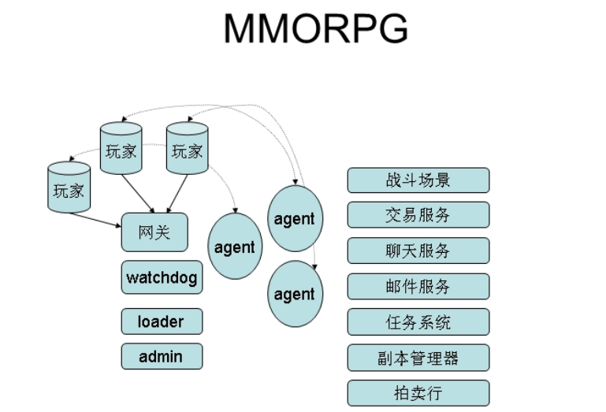

## skynet: 基于 Actor 模式的开源框架

Skynet 是一个基于C跟lua的开源服务端并行框架， 作者：云风（ 简悦科技 云风）。

作者视频解说skynet： http://gad.qq.com/content/coursedetail?id=467 

skynet设计综述： https://blog.codingnow.com/2012/09/the_design_of_skynet.html 

先阅读完设计综述再看下面的内容。

Code Base

- 1000行C核心服务代码
- 1000行lua核心库
- 5000行lua外围库
  - redis/mysql/mongodb driver
  - crypt, sproto, sharedata, etc

## 消息调度模块

按照cpu的核心配置工作线程，actor的数量是远大于工作线程的数量的，一个actor向另一个actor发消息，actor拿到消息之后再去处理。

skynet维护一个全局的消息队列，每个消息队列里包含所有actor（含有待处理消息的actor），每个actor有自己的消息队列，所有的工作线程去消息队列里去拿到actor，再从actor里拿到消息再丢给actor去处理。线程会一直去拿消息处理，除非全局消息队列为空，线程才会休息。

## 异步编程

**coroutine vs callback**

callback：异常传播困难。

coroutine(协程)：有自己的调用栈，协程间切换由程序员控制，而线程间切换受系统控制。

--协程切换内存开发小，异常传播很容易。

--复用coroutine避免过频的GC(垃圾回收)

## Actor 沙盒

actor 模式保证单独的actor出问题尽量把产生的影响变得最小。

**传统模式**下的理念是代码尽量不要出错，代码上线前多测试。

**Actor模式**是代码不可避免的会出错，出错尽量把出错的范围降到最小，不要影响到其他的服务。如果有严重的错误，可以从严重的错误里恢复起来。

## 通讯协议

**进程内消息传递**

通过文本协议序列化发送到其他的服务，收到消息的服务在反序列化回来。

- 文本协议(C服务)
- 自定义序列化库(Lua服务)
- 内存数据结构(自定义)

**跨进程消息传递**

通过现有的协议进行传递。

- 自定义协议
- 世面上的协议：sproto, google proto buffers, json, etc...

**广播和组播**

​	...

## 分布式解决方案

**skynet支持两种分布式方案**

-- harbor 模式用于扩展计算能力的不足

--cluster 模式提供弹性

--可以一起使用

**如果没有必要，请在一台机器解决，使用cluster做弱关联**

**不做热更新，只做热修复**

--A/B滚服, 定期维护，减少复杂度。

## MMOPRG

 MMORPG: Massive Muti-player Online RPG 多人在线RPG 

 魔兽 传奇 都是MMO 

 RPG:Role Playing Game角色扮演游戏 

agent 玩家的代理，所有的玩家操作通过agent和其他的服务打交代，不需要交互的操作通过agent自己解决。

## 典型手游集群

## 调优和优化

- 内建性能分析模块
- Lua模块内建监控协议
- 替换CRT内存管理库(jemalloc)
- 进程内消息传递减少拷贝
- 优化向自身发送的消息
- 合并timer请求
- 高性能要求的服务使用C/C++编写(慎用)
- 为Lua线程C模块
  - AOI
  - 寻路
  - 组播
  - 公式计算
- 优化登陆，找到热点，避免单点

