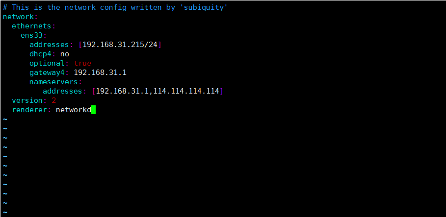

**修改yaml配置文件**



```
sudo vi /etc/netplan/00-installer-config.yaml

network:
  ethernets:
    ens33:     #配置的网卡的名称
      addresses: [192.168.31.215/24]    #配置的静态ip地址和掩码
      dhcp4: no    #关闭DHCP，如果需要打开DHCP则写yes
      optional: true
      gateway4: 192.168.31.1    #网关地址
      nameservers:
         addresses: [192.168.31.1,114.114.114.114]    #DNS服务器地址，多个DNS服务器地址需要用英文逗号分隔开
  version: 2
  renderer: networkd    #指定后端采用systemd-networkd或者Network Manager，可不填写则默认使用systemd-workd
```

根据自己的需要配置好之后保存文件

**使配置的ip地址生效**

`sudo netplan apply`

好了，使用ifconfig命令查看配置的新ip地址是否生效了吧

注意事项

1、ip地址和DNS服务器地址需要用[]括起来，但是网关地址不需要

2、注意每个冒号后边都要先加一个空格

3、注意每一层前边的缩进，至少比上一层多两个空格