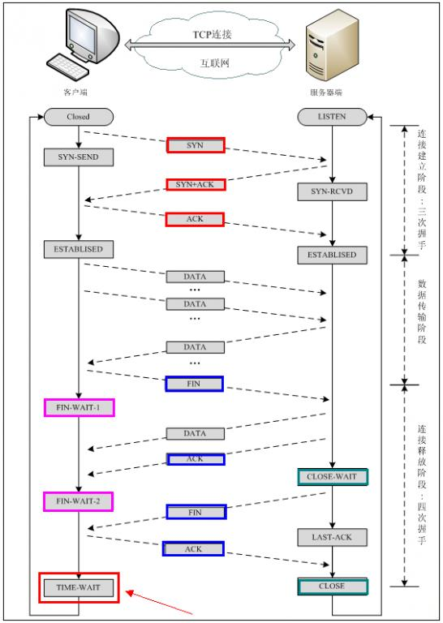
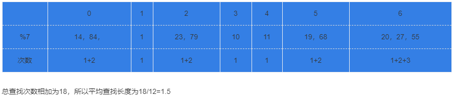

**1. 有B+Tree/Hash_Map/STL Map三种数据结构。对于内存中数据，查找性能较好的数据结构是（），对于磁盘中数据，查找性能较好的数据结构是（）。**


- Hash操作能根据散列值直接定位数据的存储地址，设计良好的hash表能在常数级时间下找到需要的数据，但是更适合于内存中的查找。
- B+树是一种是一种树状的数据结构，适合做索引，对磁盘数据来说，索引查找是比较高效的
- STL_Map的内部实现是一颗红黑树，但是只是一颗在内存中建立二叉树树，不能用于磁盘操作，而其内存查找性能也比不上Hash查找。

因此对于内存中数据，查找性能较好的数据结构是Hash_Map，对于磁盘中数据，查找性能较好的数据结构是B+Tree。

----------------------------

**2. tcp三次握手创建连接，双方交互的报文中SYN和ACK的序列是什么样的()**



在TCP/IP协议中，TCP协议提供可靠的连接服务，采用三次握手建立一个连接。

第一次握手：建立连接时，客户端发送syn包(syn=j)到服务器，并进入SYN_SEND状态，等待服务器确认；

第二次握手：服务器收到syn包，必须确认客户的SYN（ack=j+1），同时自己也发送一个SYN包（syn=k），即SYN+ACK包，此时服务器进入SYN_RECV状态；

第三次握手：客户端收到服务器的SYN＋ACK包，向服务器发送确认包ACK(ack=k+1)，此包发送完毕，客户端和服务器进入ESTABLISHED状态，完成三次握手。

完成三次握手，客户端与服务器开始传送数据。

-----------

**3. ISO网络七层模型**

物理层：通过媒介传输比特,确定机械及电气规范（比特Bit）

数据链路层：将比特组装成帧和点到点的传递（帧Frame）

网络层：负责数据包从源到宿的传递和网际互连（包PackeT）

传输层：提供端到端的可靠报文传递和错误恢复（段Segment）

会话层：建立、管理和终止会话（会话协议数据单元SPDU）

表示层：对数据进行翻译、加密和压缩（表示协议数据单元PPDU）

应用层：允许访问OSI环境的手段（应用协议数据单元APDU）


------------

**4. a, b 是多少？**

```
char *p1;int64 *p2;
p1=(char *)0x800000;
p2=(int64 *)0x800000;
char *a=p1+2
int64_t *b=p2+2
那么a=1,b=2
```

指针里面存的是地址，所以指针的加减也是为了求得变化后的地址，即假设指针的类型是T,那么新的地址应该就是原地址+sizeof(T)个字节后得到的地址，也就是说它加的实质还是相应的字节数，而这个字节数是多少得看指针的类型，本题中第一个是char类型，那么加2就是俩个字节，第二个是64位的int,那么相应的指针类型就是8字节,因为指针就是为了寻地址的，与cpu的位数有关，一个字节8位，因此它加2就是加2\*sizeof(int64)，转16进制为0x1

--------

**5. 已知有一个关键字序列：（19，14,23,1,68,20,84,27,55,11,10,79）散列存储在一个哈希表中，若散列函数为H（key）=key%7，并采用链地址法来解决冲突，则在等概率情况下查找成功的平均查找长度为（）。**



------

**6. 计算机网络中，所有的计算机都连接到一个中心节点上，一个网络结点需要传输数据，首先传输到中心节点上，然后由中心节点转发到目的节点 ，这种连接结构被称为（）**

- 总线结构是指所有计算机通过一跟总线通信
- 环形结构相当于多台计算机的网线手拉手围成一个圈的连接模型
- 星型结构是有一个中心点，向外辐射出多条链路，*符合题目描述的情况*
- 网状结构也就是计算机之间交互连接，任意两台计算机之间直接或者间接相连


---------- 

**7. ARP 协议**

ARP协议和RARP协议是作用于数据链路层的，ARP协议的作用是将IP地址转换为物理地址，它的工作原理是，将ARP请求报文广播到所在网络上的所有主机，报文中含有目的主机的IP地址，只有目标主机可以返回一个ARP应答报文，报文中含有该主机的物理地址。

ARP协议工作在数据链路层，但是属于网络层。

----------

**8. 运行下面这段代码，会出现的情况是:()**

```c
void GetMemory(char *p)
{
    p = (char *)malloc(100);
}
void Test(void)
{
    char *str = NULL;
    GetMemory(str);
    strcpy(str, "hello world");
    printf(str);
}
```

GetMemory(char \*p);这里\*p是形参, 是局部变量不能将malloc申请的地址指针返回，造成内存泄露更严重的是执行GetMemory(str);
后str依然为NULL执行strcpy(str, 'hello world'); 就会出错

--------------------
**9.**
```c
在32位系统中：
char arr[] = {4, 3, 9, 9, 2, 0, 1, 5};
char *str = arr;
sizeof(arr) = 1;
sizeof(str) = 2;
strlen(str) = 3;
```

sizeof(arr)求出了为arr的长度乘以arr类型所占的字节数，这里arr是char型的，每个数据占一个字节，所以sizeof(arr)得到8

sizeof(str)这里str是字符指针，32为系统中指针占4个字节，所以为4

strlen(str)求字符串长度，这里的字符串由字符数组得到，字符数组中赋值的是字符的ASCII值, 其中ASCII值为0的代表字符中的‘\0’也就是字符串结束的标志，所以得到的长度为5

-----------------------
**10.**

有这样一个类：

```c++
class Eye
{
    public:
    void Look(void);
};
```

现在希望定义一个Head类，也想实现Look的功能，应该使用（）方法，实现代码重用。

!!!answer
    组合是在新类中以原有类的对象作为数据成员，继承是在不改变现有的类的基础上，采用现有类的形式并在其中添加新代码，组合一般用于在新类中使用现有类的功能而不是他的接口的情况，就是新类用户看到的只是为新类所定义的接口。而继承则是用于在新类需要向基类转化的情况（多态），这也是组合和继承使用的最清晰的判断方法。
    结合本题分析，我们只需让眼睛作为头的一个成员即可，而让头去继承眼睛的特性是没有必要的。
