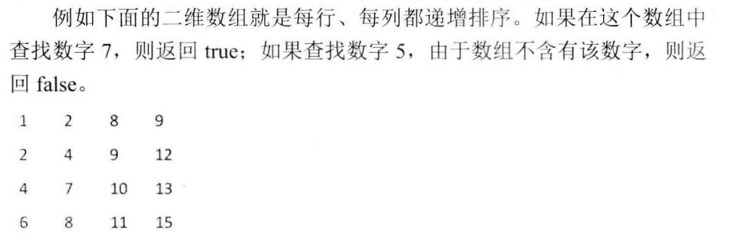
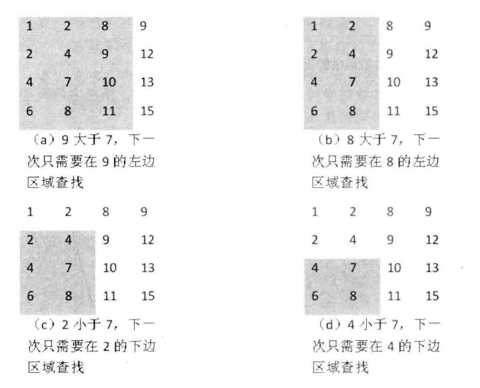

数组可以说是最简单的一种数据结构，它占据一块连续的内存并按照顺序存储数据。

创建数组时，需要先指定数组容器的大小，然后根据大小分配内存。

由于数组的内存是连续的，于是可以根据下标在O(1)时间读写任何元素，因此它的时间效率很高。

**根据数组时间效率高的优点, 实现简单的哈希表**，用数组来实现简单的哈希表，把数组的下标设为哈希表的键，数组元素为哈希表的值，
有了这样的哈希表，我们可以在O(1)时间内查找。

**为了解决数组空间效率不高的问题**，人们又设计实现了多种动态数组，比如c++中的STL中的vector，为了避免浪费，先为数组开辟较小的空间，然后往数组中添加数组。
当数组的数据超过数组容量时，我们再重新分配一块更大的空间(c++ 中vector 为之前的两倍，python list也为之前的两倍)，把之前的数据复制到新数组中，再把之前的内存释放。
这对时间性能有负面影响，因此使用动态数组时要尽量减少改变数组容量大小的次数。

### 关键点1
在c/c++中，数组和指针是既相关又有区别的概念，当我们声明一个数组时，其数组的名字也是一个指针，该指针指向数组的第一个元素。我们可以用指针来访问数组。 
c/c++没有记录数组的大小，因此在访问数组元素时，程序员要确保没有超出数组的边界。

运行下面代码，请问输出什么？

```c++
#include <iostream>
using namespace std;

int GetSize(int data[])
{
	return sizeof(data);
}

int main(int argc, const char* argv[])
{
	int data1[] = {1, 2, 3, 4, 5};
	int size1 = sizeof(data1);

	int* data2 = data1;
	int size2 = sizeof(data2);

	int size3 = GetSize(data1);
	cout << size1 << endl << size2 << endl << size3 << endl;
	return 0;
}
```

答案是： 20， 8， 8，data是一个数组，sizeof(data)求的是数组的大小，5个整数，每个整数占4个字节，因此占20个字节。
data2是指针，指针在32位操作系统上占4位，64位操作系统占8位。在c/c++中，当数组当作函数的参数进行传递时，数组就自动退化为同类型的指针。因此，尽管函数GetSize的参数data被声明为数组，但他会退化为指针。

### 面试题3: 

#### 找出数组中重复的数字

!!!question
	在一个长度为n的数组里的所有数字都在0~n-1的范围内。数组中某些数字是重复的，但是不知道有几个数字是重复的了，也不知道数字重复了几次。请找出数组中任意一个重复的数字。例如，如果输入长度为7的数组{2,3,1,0,2,5,3},那么对应的输出重复的数字2或者3。


!!!tip
	解法一: 解决这个问题的一个简单的办法是先把输入的数组排序。从排序的数组中找出重复的数字只需要扫描排序的数组就可以了。排序一个长度为n的数组需要O(nlgn)的时间。 

	解法二: 还可以利用哈希表来解决这个问题，从头到尾按顺序扫描数组的每个数字，每扫描到一个数字的时候，都可以用O(1)的时间来判断哈希表里是否已经包含了该数字，如果哈希表里还没有这个数字，就把它加入到哈希表。如果哈希表里已经存在这个数字，就找到了一个重复的数字。这个算法的时间复杂度是O(n)，但它提高时间效率是以一个大小为O(n)的哈希表为代价的。

	解法三: 我们注意到数组中的数字都在0~n-1的范围内。如果这个数组中没有重复的数字，那么当数组排序之后数组i将出现在下标为i的位置。由于数组中有重复的数字，有些位置可能存在多个数字。 现在让我们重排数组，从头到尾扫描数组，当扫描到下标i时，判断数组下标i的元素是否和i相同（arr[i] == i），不相同，则把它和第arr[i]个数进行交换（swap(arr[i], arr[arr[i]])），直到arr[i]和i同等，把arr[i]放回属于他的位置。重复上述的操作。
	直到我们发现一个重复的数字。
	```c++
	arr[] = {2, 3, 1, 0, 2, 5, 3}
	i = 0; arr[i] != i; swap(arr[i], arr[arr[i]]);  // {1, 3, 2, 0, 2, 5, 3}
		   arr[i] != i; swap(arr[i], arr[arr[i]]);  // {3, 1, 2, 0, 2, 5, 3}
		   arr[i] != i; swap(arr[i], arr[arr[i]]);  // {0, 1, 2, 3, 2, 5, 3}
    i = 1; arr[i] == i;
    i = 2; arr[i] == i;
    i = 3; arr[i] == i;
    i = 4; arr[i] != i; arr[arr[i]] = arr[i]; return arr[i];
    ```

!!!answer
	c++: <a href="https://github.com/yiouejv/blog/blob/master/docs/%E5%89%91%E6%8C%87offer/codes/array_repeat.cpp">array_repeat.cpp</a>

	python: <a href="https://github.com/yiouejv/blog/blob/master/docs/%E5%89%91%E6%8C%87offer/codes/array_repeat.py">array_repeat.py</a>

本题考点：

- 老查应聘者对一维数组的理解及编程能力。一维数组在内存种占据连续的空间，因此我们可以根据下标定位对应的元素。
- 考查应聘者分析问题的能力。当应聘者发现问题比较复杂时。 能不能通过具体的例子找出其中的规律，是能否解决这个问题的关键。

#### 不修改数组找出重复的数字

!!!question
	在一个长度为n+1的数组里的所有数字都在1~n的范围内，所以数组种至少有一个数字是重复的。 请找出数组中任意一个重复的数字，但不能修改输入的数组。例如，如果输入长度为8的数组{2, 3, 5, 4, 3, 2, 6, 7}, 那么对应的输出是重复的数字2或者3。

!!!tip
	解法一: 看起来和上一题类似，由于题目要求不能修改输入的数组，我们可以创建一个n+1的数组为哈希表来辅助，则需要O(n)的空间，O(n)的时间。

	解法二: 接下来我们尝试O(1)的空间，我们把从1-n是数字从中间的数字m分为两部分，前一半为1~m，后一半为m+1~n，如果1~m的数字出现的次数超过m，那么这一半肯定有重复的数字，否则另一半肯定有重复的数字。我们可以继续把重复的区间一分为二，直到找到一个重复的数字。这个过程和二分法很像，只是多了一步统计区间里的数字。
	每次统计范围内的数字O(n)，二分查找O(lgn)，时间复杂度为O(nlgn)，空间复杂度为O(1)，这是利用时间换空间的算法。
	```c++
	int nums[] = {2, 3, 5, 4, 3, 2, 6, 7};  // length = 8;
	//mid=(1+8)/2, 1~4 出现了5次，5-7 出现了3次，重复数字在1~4内
	//mid=(1+4)/2, 1~2 出现了2次，3-4 出现了3次，重复数字在3~4内
	//mid=(3+4)/2, 3 出现了2次，4 出现了1次，重复数字为3
	```
	需要指出的是，这种算法并不能找出所有重复的数字。例如上例，我们只找出了3，其实2也是重复的，所以如果面试官要求的功能不同或是性能要求不同，我们选择的算法也不相同，这就需要和面试官沟通。

!!!answer
	c++: <a href="https://github.com/yiouejv/blog/blob/master/docs/%E5%89%91%E6%8C%87offer/codes/array_repeat2.cpp">array_repeat2.cpp</a>

	python: <a href="https://github.com/yiouejv/blog/blob/master/docs/%E5%89%91%E6%8C%87offer/codes/array_repeat2.py">array_repeat2.py</a>

本题考查：

- 考查一维数组的理解和编程能力。
- 考查应聘者对二分法的理解，并能快速、正确地实现二分查找算法。
- 考查应聘者的沟通能力，应聘者只有具备良好的沟通能力，才能充分了解面试官的需求，从而针对性地选择算法解决问题。

### 面试题4: 二维数组中的查找

!!!question
	在一个二维数组中，每一行都按照从左到右的递增的顺序排序，每一列都按照从上到下的顺序排序。请完成一个函数，输入这样的一个二维数组和一个整数，判断数组中是否含有该整数。
	

!!!tip
	解法一: 遍历数组，判断目标元素是否在二维数组内，时间复杂度`O(m*n)`, 空间复杂度O(1);

	解法二: 找到目标元素所在的列，遍历目标列，时间复杂度`O(m+n)`，空间复杂度O(1);

	解法三: 从最右上角开始找，首先，我们选取数组右上角的9，由于9>7, 并且9还是第4列的最小的数，因此7不可能出现在数字9所在列，于是我们把这一列从需要考虑的区域踢出，整个过程如下如所示。
	

!!!answer
	c++: <a href="https://github.com/yiouejv/blog/blob/master/docs/%E5%89%91%E6%8C%87offer/codes/find_number_in_2D_array.cpp">find_number_in_2D_array.cpp</a>

	python: <a href="https://github.com/yiouejv/blog/blob/master/docs/%E5%89%91%E6%8C%87offer/codes/find_number_in_2D_array.py">find_number_in_2D_array.py</a>
	