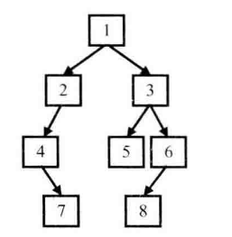
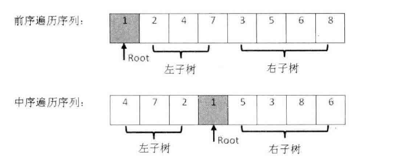

树是一种在实际编程中经常遇到的数据结构。

它的逻辑很简单： 

- 除根节点之后的每个节点只有一个父节点，根节点没有父节点
- 除叶子节点之后所有节点都有一个或多个子节点，叶节点没有子节点
- 父子节点之间用指针链接

由于树操作会涉及大量的指针，因此与树有关的面试题都不太容易。

面试的时候提到的树，大部分是二叉树。所谓二叉树是树的一种特殊结构，在二叉树中每个节点最多只能有两个子节点。
二叉树中最重要的操作莫过于遍历，即按照某一顺序访问树中的所有节点。 通常树有如下几种遍历方式。

- 前序遍历, 先访问根节点，再访问左子节点，最后访问右节点
- 中序遍历，先访问左子节点，再访问根节点，最后访问右子节点
- 后序遍历，先访问左子节点，再访问右子节点，最后访问根节点

这3中遍历都有递归和循环两种不同的实现方法。 每种遍历的递归实现都比循环实现简洁很多。
很多面试官喜欢直接或简介考查遍历（面试题26，34， 55，7，33）

**因此应聘者应该对这3中遍历的6种实现方式都了如指掌**

广度优先遍历

先访问树的第一层节点，再访问树的第二层节点，一直访问到最下面一层节点。 在同一层节点中，以从左到右的顺序依次访问。

二叉树

- 二叉搜索树，左子节点总是小于或等于根节点，而右子节点总是大于或等于根节点。（二叉搜索树与双向链表，树中两个节点的最低公共祖先）
- 堆
	- 最大堆，根节点的值最大
	- 最小堆，根节点的值最小

	快速找到最大值或最小值问题都可以同堆来解决
- 红黑树，把树中的节点定义为红黑两种颜色，并通过规则确保从根节点到叶子节点的最长路径的长度不超过最短路径的两倍。（最小的k个数）

	在c++的STL中，set, multiset, map, multimap等数据结构都是基于红黑树实现的。

### 面试题7: 重建二叉树

!!!question
	输入某二叉树的前序遍历和中序遍历的结果，请重建二叉树。 假设输入的前序遍历和中序遍历的结果中都不含重复的数字。
	例如，输入前序遍历序列{1, 2, 4, 7, 3, 5, 6, 8}, 和中序遍历序列{4, 7, 2, 1, 5, 3, 8, 6}, 则重建如下图所示的二叉树并输出它的头节点。

	

!!!tip
	在二叉树的前序遍历序列中，第一个数字总是树的根节点的值。 但在中序遍历序列中，根节点的值在序列的中间，左子树的节点位于根节点值的左边，而右子树的值位于根节点值的右边，因此我们需要扫描中序序列，才能找到根节点的值。

	

	如图所示，前序遍历的第一个数字1就是根节点的值。扫描中序遍历，就能确定根节点值的位置，根据中序遍历的特点，在根节点的值1前面的3个数字都是左子树节点的值，位于1后面的数字都是右子树节点的值

	由于在中序遍历序列中，有3个数字是左子树节点的值，因此左子树共有3个左子节点，同样，在前序遍历序列中，根节点后面的3个数字就是左子树节点的值，再后面的所有数字都是右子树节点的值。这样我们就在前序遍历和中序遍历两个序列中分别找到了左右子数对应的子序列。

	既然我们分别找到了左右子树的前序遍历序列和中序遍历序列，我们可以用同样的方法分别构建左右子树。 也就是说，接下来的事可以用递归的方法去实现.

!!!answer

	```c++
	struct Node
	{
	    int value;
	    Node* leftTree;
	    Node* rightTree;
	};

	Node* BuildCore
	(
	    int* startPre, int* endPre,
	    int* startIn, int* endIn
	)
	{
	    // 前序遍历第一个值拿到根节点的值
	    Node* root = new Node();
	    root->value = *startPre;

	    if (startPre == endPre)
	    {
	        if (startIn == endIn && *startPre == *startIn)
	            return root;
	        throw std::exception("Invalid Input");
	    }

	    // 在中序遍历中的找到根节点的值
	    int* rootValueIn = startIn;
	    while (rootValueIn <= endIn && *rootValueIn != *startPre)
	        ++rootValueIn;

	    if (*rootValueIn != *startPre)
	        throw std::exception("Invalid Input");

	    int startInLength = rootValueIn - startIn;

	    if (startInLength > 0)
	    {
	        root->leftTree = BuildCore(startPre + 1, startPre + startInLength,
	            startIn, rootValueIn - 1);
	    }
	    if (endIn - rootValueIn > 0)
	    {
	        root->rightTree = BuildCore(startPre + startInLength + 1, endPre,
	            rootValueIn + 1, endIn);
	    }
	    return root;
	}

	Node* BuildTree(int* pre, int* in, int length)
	{
	    if (pre == nullptr || in == nullptr || length <= 0)
	        return nullptr;
	    return BuildCore(pre, pre + length - 1, in, in + length - 1);
	}
	```

	完整代码: <a href="https://github.com/yiouejv/blog/blob/master/docs/%E5%89%91%E6%8C%87offer/codes/BuildTree.cpp">BuildTree.cpp</a>

	在函数BuildCore 中,我们先根据前序遍历序列中的第一个数字创建根节点, 接下来在中序遍历中找到根节点的位置,这样就能确定左右子树节点的数量. 在前序遍历中和中序遍历中划分了左右子树节点的值之后,我们就可以递归的调用函数BuildCore 去分别构建左右子树.


测试用例

- 普通二叉树(完全二叉树, 不完全二叉树)
- 特殊二叉树(所有节点都没有右子节点的二叉树, 所有节点都没有左子节点的二叉树, 只有一个节点的二叉树)

### 面试题8: 二叉树的下一个节点

!!!question
	给定一棵二叉树和其中一个节点, 如何找出中序遍历的下一个节点? 树中的节点除了有两个分别指向左右字节点的指针, 还要一个指向父节点的指针.

!!!tip
	由中序遍历可知, 如果节点存在右子树, 则下一个节点为右子树的最左子节点, 如果不存在右子树, 则一直往上找, 如果节点p为父节点的左子节点, 则下一节点为p的父节点

!!!answer
	```c++
	Node* InOrderNodeNextValue(Node* pNode)
	{
	    if (pNode == nullptr)
	        return nullptr;

	    Node* p = nullptr;
	    // 如果该节点存在右子树，则下一个节点为右子树的最左子节点
	    if (pNode->rightTree != nullptr)
	    {
	        p = pNode->rightTree;
	        while (p->leftTree != nullptr)
	            p = p->leftTree;
	        return p;
	    }
	    // 如果该节点不存在右子树，则一直往上找, 如果节点是它父节点的左子节点, 那么下一个节点为它的父节点
	    else
	    {
	        p = pNode;
	        while (p->parentNode != nullptr && p->parentNode->leftTree != p)
	            p = p->parentNode;
	        return p->parentNode;
	    }

	    return nullptr;
	}	
	```

	完整代码: <a href="https://github.com/yiouejv/blog/blob/master/docs/%E5%89%91%E6%8C%87offer/codes/InOrderNodeNext.cpp">InOrderNodeNext</a>

本题考点:

- 考查应聘者对二叉树中序遍历的理解程度. 只有对二叉树的遍历算法有深刻的理解. 才能准确找出每个节点的中序遍历的下一个节点.
- 考查应聘者分析复杂问题的能力, 应聘者只有画出二叉树的结构图, 通过具体的例子找出中序遍历下一个节点的规律, 才可能设计出可行的算法. 

