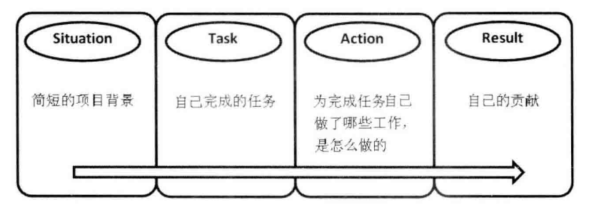
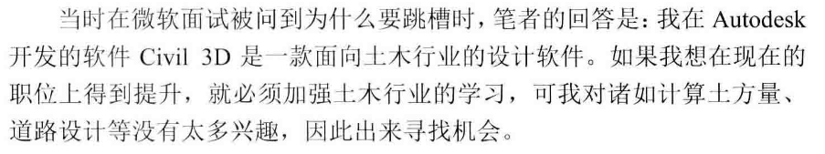
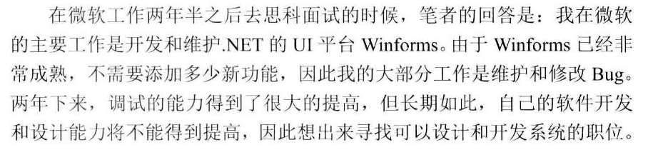
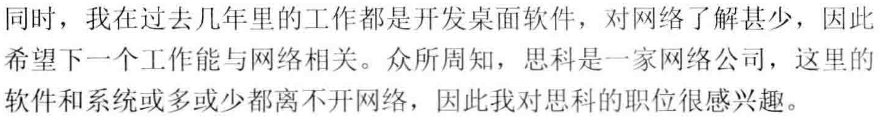
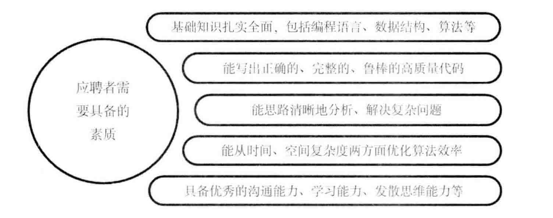
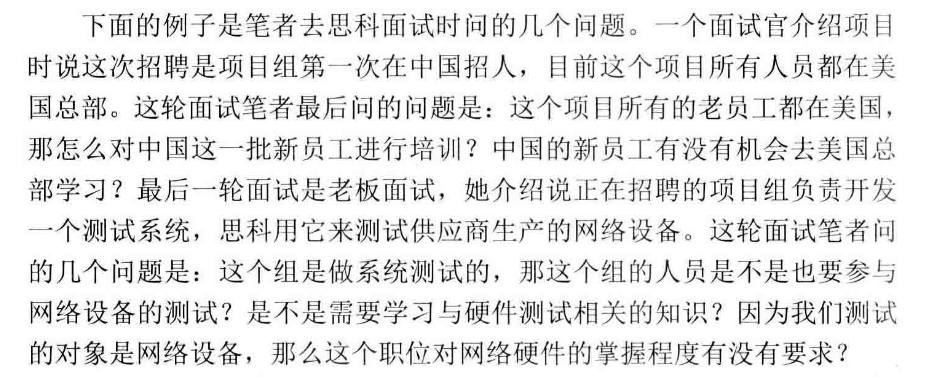

### 电话面试

- 面试官打电话的形式考查应聘者，会提前约好时间
- 有些面试官喜欢搞突然袭击，建议应聘者在投出简历之后的一两个星期之内，保证手机电池能至少连续通话一小时。应聘者不要长时间待在很嘈杂的环境下。
- 电话面试只能依靠声音，描述复杂算法的时候尽可能形象把细节说清楚。 例如，现场面试的时候，如果要描述二叉树的结构，可以用笔在白纸上画出来，电话面试则需要把二叉树中有哪些节点，每个节点的左节点是什么，右节点是什么都说得很清楚。

### 共享桌面面试

- 应聘者把自己的桌面远程分享给面试官，面试官可以观看应聘者编程和调试的过程。
- 面试官关心应聘者的编程习惯及调试能力。 通常面试官会认可以下几个点：
	- 思考清楚再开始编码
	- 良好的代码命名和缩进对齐习惯
	- 能够进行单元测试

### 现场面试

前往公司参加面试之前

- **规划好路线并估算出行时间**，预留半小时缓冲时间应对堵车等意外情况
- **注意面试邀请函里的面试流程**。 如果面试有好几轮，时间很长，面试过程可能会觉得疲劳，思维迟钝，可以带些提神饮料。
- **准备几个问题**，每轮面试的最后，面试官都会让应聘者提问。
- 准备好得体的衣服

### 面试的3个环节

- 行为面试： 面试官参照简历了解应聘者过往经验。
- 技术面试：要求应聘者现场写代码。
- 应聘者提问。

#### 行为面试

面试官会注意应聘者的性格特点，深入了解简历中举例的项目经历。
不少面试官会让应聘者做一个简短的自我介绍，由于面试官手拿简历，因此自我介绍不用花很多时间。 用30秒到1分钟的时间介绍自己的主要学习，工作经历即可。

如果面试官对你的经历或项目感兴趣，那么他会有针对性地提问。
##### 应聘者的项目经验

建议根据STAR法则描述自己的项目经历。

- Situation 简短的项目背景：项目规模，开发的软件功能，目标用户等。
- Task 自己完成的任务：这个要写详细，要让面试官对自己的工作一目了然，用词上注意区分“参与” 和 “负责”。 “负责”了某个项目，面试官可能会问项目的总体设计，核心算法，团队合作等问题，只是“参与”很难回答。
- Action 为完成任务自己做了哪些工作，怎么做的。 这里可以详细介绍。
	- 做系统设计的，可以介绍系统架构的特点
	- 做软件开发的，可以写基于什么工具在哪个平台下应用了哪些技术
	- 做软件测试的，可以写是手工测试还是自动化测试等
- Result 自己的贡献：这方面的信息可以写的具体些，最好能用数字加以说明。
	- 参与功能开发，则可以说按时完成了多少功能。
	- 做优化，则可以说性能提高的百分比是多少
	- 如果是维护，则可以说修改了多少个bug

举例：

> winforms是微软.NET 中的一个成熟的UI平台（Situation）。 本人的工作是添加少量新功能之外只要负责维护已有的功能（Task）。新的功能主要是让winforms的控件风格和Vista、windows 7 的风格保持一致。 在维护方面，对于较难的问题，我用winDbg 等工具进行调试（Action）。 在过去的两年中，我共修改了超过200个bug（Result）。

如果在应聘者的简历中上述4类信息不够清晰，则面试官可能会追问相关问题。

- 你在该项目中碰到的最大问题是什么，你是怎么解决的。
- 从这个项目中你学到了什么。
- 什么时候会和其他团队成员，有什么样的冲突，你们是怎么解决的？

应聘者在准备简历的时候，针对每一个项目经历都应提前做好相应的准备，只有准备充分，应聘者在行为面试环节才可以表现的游刃有余。

!!! tip
	在介绍项目经验(包括在简历上介绍和面试时的口头介绍)时，应聘者不必详述项目的背景，而要突出介绍自己完成的工作以及取得的成绩。

##### 应聘者掌握的技能
	
描述技能的掌握程度时要注意“了解”，“熟悉”，“精通” 的区别。

- 了解：某项技术只是上过课或者看过书，但没有做过实际的项目。
	- 通常不建议在简历充列出只是肤浅的了解一点的技能，除非这项技术应聘的职位的确需要。
- 熟悉：在实际项目中使用某项技能已经有较长时间，通过查阅相关的文档可以独立解决大部分问题。
- 精通：对某项技能使用得心应手，在项目开发过程中，有同事请教，我们有信心有能力解决。

##### 回答“为什么跳槽”

面试官通过这个问题来了解应聘者的性格，应聘者可以大胆根据真实想法回答，但也不要想什么说什么，避免留下坏印象。

回答的时候不要抱怨，不要流露负面情绪。 尽量避免以下原因：

- 老板太苛刻。
- 同事太难相处。
- 加班太频繁。
- 工资太低。 我只管干活，工资公司看着给，相信公司不会亏待勤奋的员工。

> 现在的工作做了一段时间，已经没有太多的激情了，因此希望找一份更有挑战的工作。 具体论证厌倦的原因，以及面试的职位为什么有兴趣。

示例：

#### 技术面试

应聘者需要具备的素质

- 对编程语言、 数据结构和算法等基础知识有全面的了解。
- 面试遇到简单的问题，则一定要注意细节，写出完整、鲁棒的代码。 遇到复杂的问题，可以通过画图，举例子分析和分解复杂问题等方法理清思路再编程。
- 优化时间效率和空间效率，最求找到最优的解法。
- 主动提问，弄清楚题目要求，表现自己的沟通能力。
- 当面试官前后问的两个问题有相关性的时候，尽量把解决问题的思路迁移到后面的问题中去，展示自己良好的学习能力。

##### 扎实的基础知识

通常基本功再编程面试环节体现在：编程语言、 数据结构、 算法

- 至少掌握一两门编程语言
- 数据结构是重点，应聘者需要熟练掌握链表，树，栈，队列，哈希表等数据结构，以及他们的操作。
	- 链表，二叉树问得比较多。
	- 链表，插入删除
	- 二叉树各种遍历方法和递归写法。
- 查找、排序算法
	- 重点掌握二分查找，归并排序和快速排序
	- 少数算法很重视的公司还会要求熟练掌握动态规划，贪婪算法。

##### 高质量的代码

面试官会格外关注边界条件，特殊输入等，看似细枝末节，但实则至关重要。

面试的时候觉得题目很简单，感觉自己都做出来了，可最后为什么被拒了呢？ 技能面试的面试官一般都是程序员，程序员通常没有那么多想法，他们只认一个理，题目做对，做完整了，就让你通过，否则失败。 如果遇到简单题目被拒的情况，则应该认真反思在思路或代码中存在哪些漏洞。

!!! tip
	面试官除了希望应聘者的代码能够完成基本的功能，还会关注应聘者是否考虑了边界条件，特殊输入(空指针，空字符串等)，以及错误处理。

##### 清晰的思路

对于复杂的问题，面试官不期待应聘者能在面试不到一小时的时间里给出完整答案，他更看重的还是应聘者是否有清晰的思路。 

面试官不喜欢应聘者在没有形成清晰思路之前就草率的开始写代码，这样写出来的代码容易逻辑混乱，错误百出。

应聘者可以用如下几个方法帮组自己形成清晰的思路: 

- 举例子帮助自己理解问题。
- 用图形表示抽象的数据结构。 像分析与链表，二叉树相关的题目。
- 把复杂的问题分解成若干简单的子问题。 如递归，分治法，动态规划。

##### 优化效率的能力

优秀的程序员对时间和内存的消耗锱铢必较，他们很有激情的不断优化自己的代码。

- 要优化代码效率，要熟知各种数据结构的优缺点，并能选择合适的数据结构解决问题。
- 熟练的掌握常用的算法。面试中最常用的算法是查找和排序。

##### 优秀的综合能力

应聘者除了展示自己的编程能力和技术功底，还需要展示自己的软技能。

- 沟通能力。 面试官会观察应聘者在介绍项目经验或者算法思路时是否观点明确、逻辑清晰。
- 团队合作能力。 面试官会从应聘者说话的神态和语气来判断。
- 学习能力。 
	- 询问应聘者最近看什么书，学到了哪些新技术。 面试官问这个了解应聘者的学习愿望和学习能力
	- 面试官抛出一个新概念，接下来他会观察应聘者能不能在较短时间内理解这个新概念并解决相关问题。
- 知识迁移能力。 
	- 面试官经常会先问一个简单的问题，再问一个很复杂但和前面的简单问题相关的问题。 这时候面试官期待应聘者能够从简单问题中得到启示，从而找到解决复杂问题的窍门。
	- 比如面试官先要求写一个求斐波那契额数列的函数，再问一个青蛙跳台阶的问题。
- 抽象建模能力。 面试官从日常生活中提炼问题，考察应聘者能不能把问题抽象出来用合理的数据结构表示，并找到规律解决问题。
- 发散思维能力。 面试官限制不得使用常规方法，要求应聘者具备创新精神，打开思路多角度分析解决问题。

#### 应聘者提问环节

在结束面试5~10分钟，面试官会给应聘者机会问几个问题，应聘者的问题质量对面试结果也有一定的影响。
建议在面试之前做功能，为每一轮面试准备2~3个问题。

面试官让应聘者提问，主要是想了解应聘者关心的问题有哪些，因此应聘者至少要问一两个问题，否则面试官觉得你对我们公司，职位等都不感兴趣。

提问要点：

- 不要问和自己职位没有关系的问题。
- 不要问薪水。 技术面不是谈薪水的时候，要谈工资等到通过面试之后和HR谈。
- 不要立即打听面试结果。
- 推荐问与职位相关或项目相关的问题，如果提问到位，面试官会觉得你对职位很有兴趣。
	- 对应聘的职位或项目背景有一定的了解。
	- 对公司的成立时间，主要业务，职位要求等都了然于胸
	- 面试过程留意面试官说过的话，有不少面试官会在面试之前介绍项目，包含其他渠道无法得到的信息，如项目进展等。

