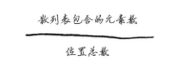
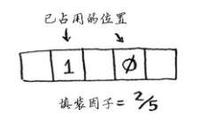
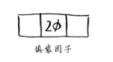
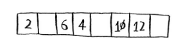
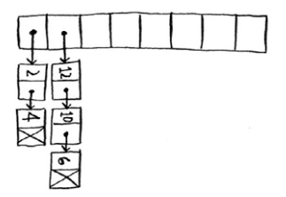
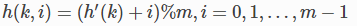
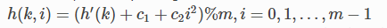
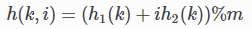

### 哈希表的工作过程

前面我们已经讲到了数组和链表，数组能通过下标 O(1) 访问，但是删除一个中间元素却要移动其他元素，时间 O(n)。 

难道就没有一种方法可以快速定位和删除元素吗？似乎想要快速找到一个元素除了知道下标之外别无他法，于是乎聪明的计算机科学家又想到了一种方法。 

能不能给每个元素一种『逻辑下标』，然后直接找到它呢，哈希表就是这种实现。它通过一个哈希函数来计算一个元素应该放在数组哪个位置，当然对于一个特定的元素，

哈希函数每次计算的下标必须要一样才可以，而且范围不能超过给定的数组长度。

### 哈希函数

即无论你给它什么数据，它都还你一个数字。 

- 必须是一致的。例如，假设你输入apple时得到的是4，那么每次输入apple时，得到的都必须为4。如果不是这样，散列表将毫无用处。 
- 它应将不同的输入映射到不同的数字。例如，如果一个散列函数不管输入是什么都返回1，它就不是好的散列函数。最理想的情况是，将不同的输入映射到不同的数字。 

散列函数准确地指出了价格的存储位置， 你根本不用查找！ 之所以能够这样， 具体原因如下。 

- 散列函数总是将同样的输入映射到相同的索引。每次你输入avocado，得到的都是同一个 数字。因此，你可首先使用它来确定将鳄梨的价格存储在什么地方，并在以后使用它来确定鳄梨的价格存储在什么地方。 
- 散列函数将不同的输入映射到不同的索引。avocado映射到索引4，milk映射到索引0。每 种商品都映射到数组的不同位置，让你能够将其价格存储到这里。 
- 散列函数知道数组有多大，只返回有效的索引。如果数组包含5个元素，散列函数就不会返回无效索引100。 

### 性能

在平均情况下，散列表的查找（获取给定索引处的值）速度与数组一样快，而插入和删除速度与链表一样快，因此它兼具两者的优点！但在最糟情况下，散列表的各种操作的速度都很慢。 

因此，在使用散列表时，避开最糟情况至关重要。为此，需要避免冲突。而要避免冲突，需要有： 

- 较低的填装因子
- 良好的散列函数

#### 填装因子 

散列表的填装因子很容易计算。 



散列表使用数组来存储数据，因此你需要计算数组中被占用的位置数。例如，下述散列表的填装因子为2/5，即0.4。 



下面这个散列表的填装因子为多少呢？ 



如果你的答案为1/3，那就对了。

填装因子度量的是散列表中有多少位置是空的。

#### 良好的散列函数 

良好的散列函数让数组中的值呈均匀分布。 



糟糕的散列函数让值扎堆，导致大量的冲突。 



### 小结

- 你可以结合散列函数和数组来创建散列表。 
- 冲突很糟糕，你应使用可以最大限度减少冲突的散列函数。 
- 散列表的查找、插入和删除速度都非常快。 
- 散列表适合用于模拟映射关系。 
- 一旦填装因子超过0.7，就该调整散列表的长度。 
- 散列表非常适合用于防止重复。

### 哈希冲突 (collision)

不同的 key 通过哈希函数计算后得到的下标一样， 这种情况成为哈希冲突。

怎么办呢？聪明的计算机科学家又想到了办法，其实一种直观的想法是如果冲突了我能不能让数组中对应的槽变成一个链式结构呢？这就是其中一种解决方法，叫做**链接法**(chaining)。

这样就用链表解决了冲突问题，但是如果哈希函数选不好的话，可能就导致冲突太多一个链变得太长，这样查找就不再是 O(1) 的了。 还有一种叫做开放寻址法(open addressing)，它的基本思想是当一个槽被占用的时候，采用一种方式来寻找下一个可用的槽。 （这里槽指的是数组中的一个位置），根据找下一个槽的方式不同，分为：

- 线性探查(linear probing): 当一个槽被占用，找下一个可用的槽。

	

- 二次探查(quadratic probing): 当一个槽被占用，以二次方作为偏移量。

	

- 双重散列(double hashing): 重新计算 hash 结果。 

	

### python 实现

```python
# 线性探查法解决冲突

from _array import Array


class Slot(object):

    def __init__(self, key, value):
        self.key, self.value = key, value

    def __str__(self):
        return '<key: {key}, value: {value}>'.format(key=self.key, value=self.value)

class HashTable(object):
    UNUSE = None               # 未使用过
    EMPTY = Slot(None, None)    # 使用过被删除了

    def __init__(self):
        self._items = Array(4)
        self.length = 0

    def __str__(self):
        res = ''
        for solt in self._items:
            if solt not in (HashTable.UNUSE, HashTable.EMPTY):
                res += str(solt)
        return res

    def _hash(self, key):
        return abs(hash(key)) % len(self._items)

    def _index_can_insert(self, index):
        return self._items[index] is HashTable.UNUSE or self._items[index] is HashTable.EMPTY

    @property
    def _load_factor(self):
        return self.length / float(len(self._items))

    def _find_can_insert_index(self, key):
        index = self._hash(key)

        while not self._index_can_insert(index):
            index = self._hash(index + 1)
        return index

    def _rehash(self):
        new_length = len(self._items) * 2
        old_items = self._items
        self._items = Array(new_length)

        self.length = 0
        for solt in old_items:
            if solt is not HashTable.EMPTY and solt is not HashTable.UNUSE:
                index = self._find_can_insert_index(solt.key)
                self._items[index] = solt
                self.length += 1

    def __setitem__(self, key, value):
        if key in self:
            index = self._find_key(key)
            self._items[index].value = value
        else:
            # 检查装载因子, >0.7重哈希
            if self._load_factor > 0.7:
                self._rehash()

            index = self._find_can_insert_index(key)
            self._items[index] = Slot(key, value)
            self.length += 1

    def _find_key(self, key):
    	'''
			解释一个 slot 为 UNUSED 和 EMPTY 的区别
	        因为使用的是线性探查的方式，假如有两个元素 A，B 冲突了，首先A hash 得到是 slot 下标5，A 放到了第5个槽，之后插入 B 因为冲突了，所以继续根据线性探查方式放到了 slot8。
    	    然后删除 A，槽 5 被置为 EMPTY。然后我去查找 B，第一次 hash 得到的是 槽5，但是这个时候我还是需要第二次计算 hash 才能找到 B。
    	    但是如果槽是 UNUSED 我就不用继续找了，我认为 B 就是不存在的元素。这个就是 UNUSED 和 EMPTY 的区别。
    	'''
        origin_index = self._hash(key)  # 查找起点，如果找了一圈又回到了起点，则没有key
        index = origin_index

        while self._items[index] is not HashTable.UNUSE:
            if self._items[index] is HashTable.EMPTY:  # 注意如果是 EMPTY，继续寻找下一个槽
                index = self._hash(index + 1)
                if index == origin_index:
                    return None
                continue

            if self._items[index].key == key:
                return index
            else:
                index = self._hash(index + 1)
                if index == origin_index:
                    return None

    def __getitem__(self, key):
        index = self._find_key(key)
        if index is None: return None
        return self._items[index].value

    def __len__(self):
        return self.length

    def remove(self, key):
        index = self._find_key(key)
        if index is None:
            raise KeyError()

        self._items[index] = HashTable.EMPTY
        self.length -= 1

    def __contains__(self, key):
        index = self._find_key(key)
        return index is not None

    def __iter__(self):
        for solt in self._items:
            if solt not in (HashTable.UNUSE, HashTable.EMPTY):
                yield solt.key


def test_hash_table():
    a = HashTable()
    assert(len(a) == 0)

    a[None] = None
    assert(len(a) == 1)

    a['a'] = 0
    a['b'] = 1
    assert(len(a) == 3)
    assert(a[None] is None)
    assert(a['a'] == 0)
    assert(a['b'] == 1)
    assert(a['c'] == None)

    a.remove('b')
    assert(len(a)==2)

    a['b'] = 1
    a['c'] = 2
    a['d'] = 3
    a['e'] = 4
    a['f'] = 5
    a['g'] = 6
    a['g'] = 7
    print(a)
    assert(a['b']==1)
    assert(a['c']==2)
    assert(a['d']==3)
    assert(a['e']==4)
    assert(a['f']==5)
    assert(a['g']==7)

test_hash_table()	
```