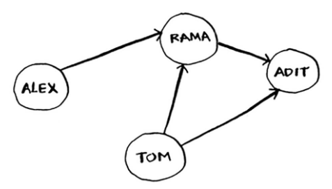
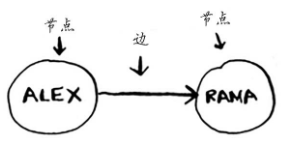
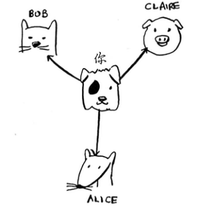
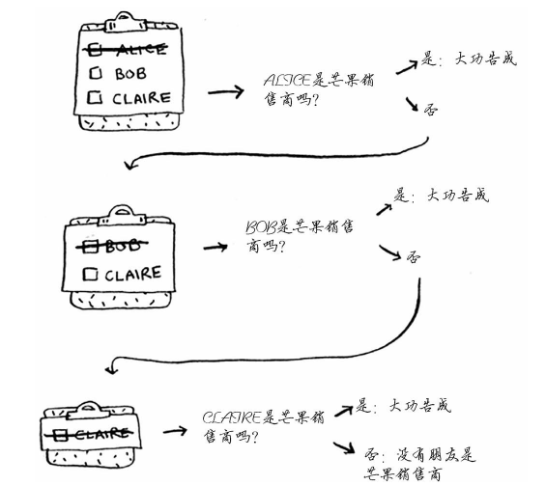
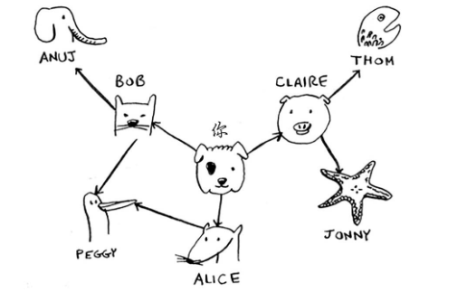
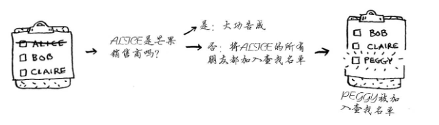
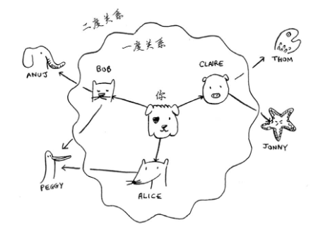
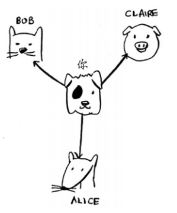
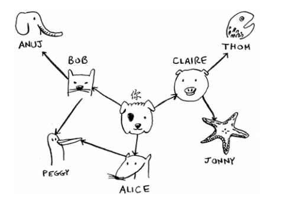

### 图

图模拟一组连接。

例如，假设你与朋友玩牌，并要模拟谁欠谁钱，可像下面这样指出Alex欠Rama钱。 


完整的欠钱图可能类似于下面这样。 



Alex欠Rama钱，Tom欠Adit钱，等等。图由节点（node）和边（edge）组成。 



就这么简单！图由节点和边组成。一个节点可能与众多节点直接相连，这些节点被称为邻居。 

在前面的欠钱图中，Rama是Alex的邻居。Adit不是Alex的邻居，因为他们不直接相连。

但Adit既是Rama的邻居，又是Tom的邻居。 图用于模拟不同的东西是如何相连的。

下面来看看广度优先搜索。 

### 广度优先搜索

广度优先搜索是一种用于图的查找算法。

可帮助回答两类问题。 

- 第一类问题：从节点A出发，有前往节点B的路径吗？ 
- 第二类问题：从节点A出发，前往节点B的哪条路径最短？ 

假设你经营着一个芒果农场，需要寻找芒果销售商，以便将芒果卖给他。

在Facebook，你与 芒果销售商有联系吗？为此，你可在朋友中查找。 



这种查找很简单。首先，创建一个朋友名单。 


然后，依次检查名单中的每个人，看看他是否是芒果销售商。 



假设你没有朋友是芒果销售商，那么你就必须在朋友的朋友中查找。 



检查名单中的每个人时，你都将其朋友加入名单。 



这样一来，你不仅在朋友中查找，还在朋友的朋友中查找。别忘了，你的目标是在你的人际 关系网中找到一位芒果销售商。因此，如果Alice不是芒果销售商，就将其朋友也加入到名单中。 这意味着你将在她的朋友、朋友的朋友等中查找。使用这种算法将搜遍你的整个人际关系网，直 到找到芒果销售商。这就是广度优先搜索算法。 

#### 查找最短路径 

再说一次，广度优先搜索可回答两类问题。 

- 第一类问题：从节点A出发，有前往节点B的路径吗？（在你的人际关系网中，有芒果销 售商吗？） 
- 第二类问题：从节点A出发，前往节点B的哪条路径最短？（哪个芒果销售商与你的关系 最近？） 

刚才你看到了如何回答第一类问题，下面来尝试回答第二类问题——谁是关系最近的芒果销售商。

例如，朋友是一度关系，朋友的朋友是二度关系。 



在你看来，一度关系胜过二度关系，二度关系胜过三度关系，以此类推。

因此，你应先在一度关系中搜索， 确定其中没有芒果销售商后，才在二度关系中搜索。 

广度优先搜索就是这样做的！ 在广度优先搜索的执行过程中，搜索范围从起点开始逐渐向外延伸，即先检查一度关系，再检查二度关系。

顺便问一句：将先检查Claire还是Anuj呢？Claire是一度关系，而Anuj是二度关系，因 此将先检查Claire，后检查Anuj。 

你也可以这样看，一度关系在二度关系之前加入查找名单。 

你按顺序依次检查名单中的每个人，看看他是否是芒果销售商。 这将先在一度关系中查找，再在二度关系中查找，因此找到的是关系最近的芒果销售商。 

广度优先搜索不仅查找从A到B的路径，而且找到的是最短的路径。 


注意，只有按添加顺序查找时，才能实现这样的目的。

换句话说，如果Claire先于Anuj加入 名单，就需要先检查Claire，再检查Anuj。

如果Claire和Anuj都是芒果销售商，而你先检查Anuj 再检查Claire，结果将如何呢？

找到的芒果销售商并非是与你关系最近的，因为Anuj是你朋友的朋友，而Claire是你的朋友。因此，你需要按添加顺序进行检查。有一个可实现这种目的的数据结构，那就是队列（queue）。 


### 实现图


首先，需要使用代码来实现图。图由多个节点组成。 



每个节点都与邻近节点相连，如果表示类似于“你→Bob” 这样的关系呢？好在你知道的一种结构让你能够表示这种关系，它就是散列表！ 

记住，散列表让你能够将键映射到值。在这里，你要将节点映射到其所有邻居。 


表示这种映射关系的Python代码如下。 

```python
graph = {}
graph["you"] = ["alice", "bob", "claire"] 
```
注意， “你”被映射到了一个数组，因此graph["you"]是一个数组，其中包含了“你”的 所有邻居。 

图不过是一系列的节点和边，因此在Python中，只需使用上述代码就可表示一个图。那像下 面这样更大的图呢？ 



表示它的Python代码如下。 

```python
graph = {}
graph["you"] = ["alice", "bob", "claire"] 
graph["bob"] = ["anuj", "peggy"] 
graph["alice"] = ["peggy"] 
graph["claire"] = ["thom", "jonny"] 
graph["anuj"] = [] 
graph["peggy"] = [] 
graph["thom"] = [] 
graph["jonny"] = [] 
```

### 代码实现

#### 解决问题一： 是否存在？
```python

from collections import deque


# 定义一个图
graph = {}
graph["you"] = ["alice", "bob", "claire"] 
graph["bob"] = ["anuj", "peggy"] 
graph["alice"] = ["peggy"] 
graph["claire"] = ["thom", "jonny"] 
graph["anuj"] = [] 
graph["peggy"] = [] 
graph["thom"] = [] 
graph["jonny"] = [] 


def find_person(target):
	'''
		查找关系网中是否存在某个人
	'''
	searched = []  # 搜索过的人
    search_queue = deque()
    search_queue += graph['you']

    while search_queue:
        person = search_queue.popleft()
        if person not in searched:
            searched.append(person)
            if person == target:
                return True
            search_queue += graph[person]
    return False


print(find_person('thom'))

```

#### 解决问题二： 最短路径


### 运行时间

如果你在你的整个人际关系网中搜索芒果销售商，就意味着你将沿每条边前行（记住，边是 从一个人到另一个人的箭头或连接） ，因此运行时间至少为O(边数)。 

你还使用了一个队列，其中包含要检查的每个人。 将一个人添加到队列需要的时间是固定的，即为O(1)，因此对每个人都这样做需要的总时间为O(人数)。所以，广度优先搜索的运行时间为 O(人数 + 边数)，这通常写作O(V + E)，其中V为顶点（vertice）数，E为边数。 


