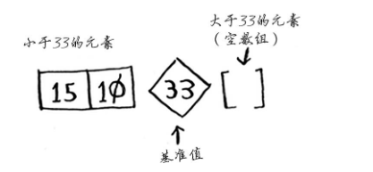
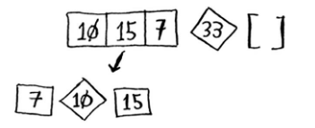
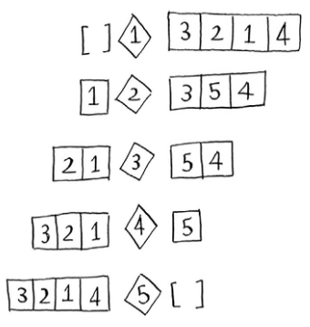
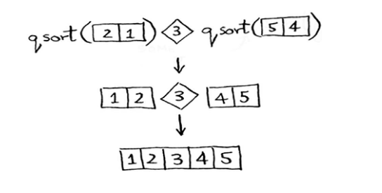
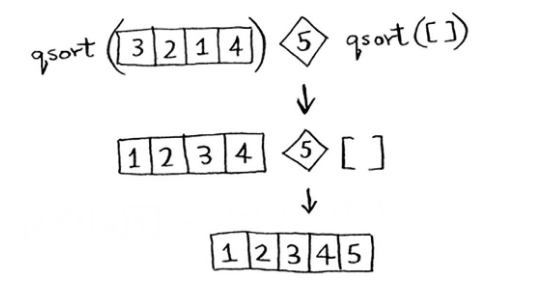

### 排序思想（摘自算法图解）
快速排序是一种常用的排序算法，比选择排序快得多。例如，C语言标准库中的函数qsort 实现的就是快速排序。快速排序也使用了D&C。 

下面来使用快速排序对数组进行排序。对排序算法来说，最简单的数组什么样呢？ 还记得前一节的“提示”吗？就是根本不需要排序的数组。 


因此，基线条件为数组为空或只包含一个元素。在这种情况下，只需 原样返回数组——根本就不用排序。 

```python
def quicksort(array):
	if len(array) < 2: return array 
```

我们来看看更长的数组。对包含两个元素的数组进行排序也很容易。 


包含三个元素的数组呢？ 


别忘了，你要使用D&C，因此需要将数组分解，直到满足基线条件。下面介绍快速排序的工 作原理。首先，从数组中选择一个元素，这个元素被称为基准值（pivot） 。 
稍后再介绍如何选择合适的基准值。 我们暂时将数组的第一个元素用作基准值。 接下来，找出比基准值小的元素以及比基准值大的元素。 



这被称为分区（partitioning）。现在你有：

- 一个由所有小于基准值的数字组成的子数组；
- 基准值； 
- 一个由所有大于基准值的数组成的子数组。 

这里只是进行了分区，得到的两个子数组是无序的。但如果这两个数组是有序的，对整个数 组进行排序将非常容易。 


如果子数组是有序的，就可以像下面这样合并得到一个有序的数组：左边的数组 + 基准值 + 右边的数组。在这里，就是[10, 15] + [33] + []，结果为有序数组[10, 15, 33]。 

如何对子数组进行排序呢？对于包含两个元素的数组（左边的子数组）以及空数组（右边的子数组） ，快速排序知道如何将它们排序，因此只要对这两个子数组进行快速排序，再合并结果， 就能得到一个有序数组！ 


不管将哪个元素用作基准值，这都管用。假设你将15用作基准值。 


这个子数组都只有一个元素，而你知道如何对这些数组进行排序。现在你就知道如何对包含三个元素的数组进行排序了，步骤如下。   
(1) 选择基准值。    
(2) 将数组分成两个子数组：小于基准值的元素和大于基准值的元素。   
(3) 对这两个子数组进行快速排序。 包含四个元素的数组呢？    


假设你也将33用作基准值。 


左边的子数组包含三个元素，而你知道如何对包含三个元素的数组进行排序：对其递归地调 用快速排序。 



因此你能够对包含四个元素的数组进行排序。如果能够对包含四个元素的数组进行排序，就 能对包含五个元素的数组进行排序。为什么呢？假设有下面这样一个包含五个元素的数组。 


根据选择的基准值，对这个数组进行分区的各种可能方式如下。 



注意，这些子数组包含的元素数都在0～4内，而你已经知道如何使用快速排序对包含0～4 个元素的数组进行排序！因此，不管如何选择基准值，你都可对划分得到的两个子数组递归地进 行快速排序。 例如，假设你将3用作基准值，可对得到的子数组进行快速排序。 



将子数组排序后，将它们合并，得到一个有序数组。即便你将5用作基准值，这也可行。 



将任何元素用作基准值都可行， 因此你能够对包含五个元素的数组进行排序。 同理， 你能够 对包含六个元素的数组进行排序，以此类推。 

### python 基于以上思路的实现
```python
'''
	需额外空间版本
'''

def quick_sort(seq):
	if len(seq) <= 1: return seq

	pivot = seq[0]
	less = [i for i in seq[1:] if i < seq[0]]
	greater = [i for i in seq[1:] if i >= seq[0]]
	return quick_sort(less) + [pivot] + quick_sort(greater)


def test_quick_sort():
	seq = list(range(10))
	import random
	random.shuffle(seq)
	assert(quick_sort(seq)==sorted(seq))
```

### 上述的改进
	上述的代码简单清晰，唯一的缺点是需要额外的存储空间，能不能在原数组的基础上进行交换，无需额外空间？

实际上是可以的。我们设置首位俩个指针 left, right，两个指针不断向中间收拢。如果遇到 left 位置的元素大于 pivot 并且 right 指向的元素小于 pivot，我们就交换这俩元素，当 left > right 的时候退出就行了，这样实现了一次遍历就完成了 partition。如果你感觉懵逼，纸上画画就立马明白了。

.png)

```python
'''
    原位置交换版本
'''

def quick_sort(seq, begin, end):
    if begin < end:
        pivot = partition(seq, begin, end)
        quick_sort(seq, begin, pivot)
        quick_sort(seq, pivot+1, end)


def partition(seq, begin, end):
    pivot_index = begin
    left = begin
    right = end

    while left < right:
        
        while seq[left] < seq[pivot_index]:
            left += 1

        while seq[right] > seq[pivot_index]:
            right -= 1

        seq[left], seq[right] = seq[right], seq[left]

    seq[pivot_index], seq[left] = seq[left], seq[pivot_index]
    return right


def test_quick_sort():
    seq = list(range(10))
    seq_copy = seq.copy()

    import random
    random.shuffle(seq_copy)
    quick_sort(seq, 0, len(seq)-1)
    assert(seq==sorted(seq_copy))
```


