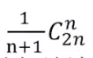

### 栈的特点

- 先进后出
- n 个不同的元素进栈，出栈元素不同排列的个数为	

### python实现

#### 数组栈

c++ 实现: <a href="../codes/stack.cpp">stack.cpp</a>

python 实现: <a href="../codes/array_stack.py">array_stack.py</a>

#### 链表栈
```python


from link_list import LinkList


class LinkListStack(object):

	def __init__(self, size):
		self.top = 0
		self._size = size
		self._items = LinkList()

	def __len__(self):
		return self.top

	def push(self, value):
		if self.top >= self._size:
			raise Exception("stack is full")

		self._items.append(value)
		self.top += 1

	def pop(self):
		if self.top <= 0:
			raise Exception("stack is empty")

		v = self._items.pop()
		self.top -= 1
		return v

	def is_empty(self):
		return self.top == 0


def test_linklist_stack():
	lltack = LinkListStack(5)

	lltack.push(1)
	lltack.push(2)
	lltack.push(3)
	lltack.push(4)
	lltack.push(5)
	# lltack.push(6)

	assert(len(lltack) == 5)

	assert(lltack.pop()==5)
	assert(len(lltack) == 4)

	assert(lltack.pop()==4)
	assert(lltack.pop()==3)
	assert(lltack.pop()==2)
	assert(lltack.pop()==1)
	# assert(lltack.pop())

	assert(lltack.is_empty())

```