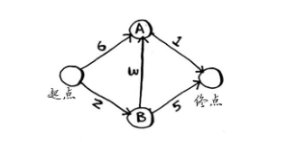

### 算法介绍
参考《算法图解》第七章或百度

### 算法功能
求解有向无环加权图的最短路径。

注意: 不能有负权边，否则参考 尔曼福德算法（Bellman-Ford algorithm）

### 算法步骤
- 找出最便宜的节点，即可在最短时间内前往的节点。 
- 对于该节点的邻居，检查是否有前往它们的更短路径，如果有，就更新其开销。 
- 重复这个过程，直到对图中的每个节点都这样做了。 
- 计算最终路径。

### python 示例

求解下图起点到终点的最短距离




```python
MAX = float('inf')

# 声明一个图
graph = {}
graph['start'] = {}
graph['start']['a'] = 6
graph['start']['b'] = 2

graph['a'] = {}
graph['a']['fin'] = MAX

graph['b'] = {}
graph['b']['a'] = 3
graph['b']['fin'] = MAX

# 记录每个节点的花费字典
costs = {}
costs['a'] = 6
costs['b'] = 2
costs['fin'] = MAX

# 记录每个节点的父节点
parents = {}
parents['a'] = 'start'
parents['b'] = 'start'
parents['fin'] = None

# 记录被处理过的节点
process = []


def find_lower_cost_node(costs):
	cost = MAX
	lower_cost_node = None

	for n in costs.keys():
		if costs[n] < cost and n not in process:
			cost = costs[n]
			lower_cost_node = n
	return lower_cost_node


def main():
	lower_cost_node = find_lower_cost_node(costs)

	while lower_cost_node is not None:
		neighbor = graph[lower_cost_node]

		for n in neighbor.keys():
			new_costs = costs[lower_cost_node] + neighbor[n]

			if costs[n] > new_costs:
				costs[n] = new_costs
				parents[n] = lower_cost_node

		process.append(lower_cost_node)
		lower_cost_node = find_lower_cost_node(costs)
	print(parents)
	

if __name__ == '__main__':
	main()
```
