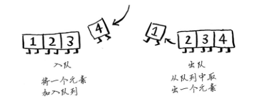
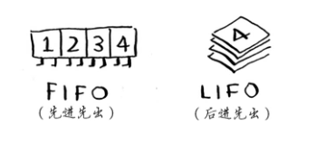

### 队列

队列的工作原理与现实生活中的队列完全相同。 

假设你与朋友一起在公交车站排队，如果你排在他前面，你将先上车。队列的工作原理与此相同。

队列类似于栈，你不能随机地访问队列中的元素。队列只支持两种操作：入队和出队。 



如果你将两个元素加入队列，先加入的元素将在后加入的元素之前出队。因此，你可使用队列来表示查找名单！这样，先加入的人将先出队并先被检查。 

队列是一种先进先出（First In First Out，FIFO）的数据结构，而栈是一种后进先出（Last In First Out，LIFO）的数据结构。 




### python 实现

```python


from _array import Array


class Queue(object):

	def __init__(self, size):
		self._items = Array(size)
		self.head, self.tail = -1, -1
		self.length = 0

	def __len__(self):
		return self.length

	def push(self, value):
		if self.is_full():
			raise Exception("queue is full")

		self.tail += 1
		index = self.tail % len(self._items)
		self._items[index] = value
		self.length += 1
		self.tail = index

	def pop(self):
		if self.is_empty():
			raise Exception("queue is empty")

		self.head += 1
		index = self.head % len(self._items)
		value = self._items[index]

		self.length -= 1
		self.head = index
		return value

	def is_full(self):
		return self.length == len(self._items)

	def is_empty(self):
		return self.length <= 0


def test_queue():
	queue = Queue(4)
	assert(len(queue) == 0)

	assert(queue.is_empty()==True)

	queue.push(0)
	queue.push(1)
	queue.push(2)
	queue.push(3)
	assert(queue.is_empty()==False)
	assert(queue.is_full()==True)

	assert(queue.pop() == 0)
	assert(queue.is_full()==False)
	assert(queue.pop() == 1)
	assert(queue.pop() == 2)

	queue.push(4)
	assert(queue.pop() == 3)
	assert(queue.pop() == 4)
	assert(queue.is_empty()==True)
	assert(0)

```

