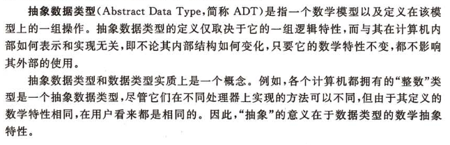

## 什么是数据结构

### 定义
- 数据： 对客观事物的符号表示，在计算机科学中是指所有能输入到计算机中并被计算机程序处理的符号的总称。  
- 数据元素： 数据的基本单位，在计算机程序中通常作为一个整体进行考虑和处理。 一个数据元素由多个数据项组成。  
- 数据对象：性质相同的数据元素的集合。 是数据的一个子集。 如：整数数据对象是集合N={0, 1, 2, 3, -1, -2, ...}
- 数据结构：  
	- 研究非数值计算的程序设计问题中计算机的操作对象以及它们之间关系和操作等的学科  
	- 相互之间存在一种或多种特定关系的数据元素的集合。  
算法的设计取决于选定的数据(逻辑)结构，而算法的实现依赖于采用的存储结构。  
- 数据类型： 数据类型是一个值的集合和定义在这个值集上的一组操作的总称。
	- 原子类型，原子类型的值是不可分解的，例如整行，字符型，枚举类型
	- 结构类型，由若干成分按某种结构组成的，因此是可以分解的
- 抽象数据类型： Abstract Data Type, 简称ADT, 是指一个数学模型以及定义在该模型上的一组操作。  

