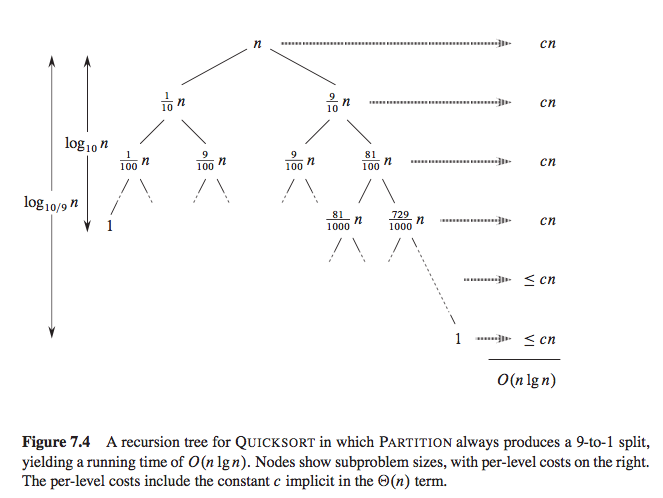

### 快速排序

快速排序是基于分治法进行排序，选取一个主元pivot, 遍历序列，将小于pivot的数字放在主元左边，大于pivot的数放在主元右边；再将左右两边的数递归下去，就排好序了。

#### 实现方案

主元(pivot)选择为序列的第一个元素，左右指针(left, right)从两端遍历序列，左指针一直找到比主元大的元素，右指针一直找到比主元小的元素，交换left, right指向的值，重复操作，直到left < right。

**注意：**

- left < right 时才交换left, right 指向的值
- 按照上述，r指向的元素一定是最后一个小于主元的数，把主元和right所指的值进行交换


```python
def quick_sort(nums, beg=0, end=None):
    end = len(nums) if end is None else end
    if beg < end:
        pivot = partition(nums, beg, end)
        quick_sort(nums, beg, pivot)
        quick_sort(nums, pivot+1, end)


def partition(nums, beg, end):
    pivot_index = beg
    left = pivot_index + 1
    right = end - 1

    while True:
        while left <= right and nums[left] < nums[pivot_index]: left += 1
        while left <= right and nums[right] >= nums[pivot_index]: right -= 1
        if left > right: break
        swap(nums, left, right)  # 交换

    # 把主元和right的位置互换
    swap(nums, pivot_index, right)
    return right


def swap(nums, left, right):
    temp = nums[left]
    nums[left] = nums[right]
    nums[right] = temp


def test_partition():
    l = [4, 1, 2, 8]
    assert(partition(l, 0, len(l))==2)
    l = [1, 2, 3, 4]
    assert (partition(l, 0, len(l)) == 0)
    l = [4, 3, 2, 1]
    assert partition(l, 0, len(l))


nums = [2, 3, 5, 1, 3, 5, 5, 6, 8, 9, 0]
quick_sort(nums)
print(nums)
```

### 时间复杂度

在比较理想的情况下，比如数组每次都被 pivot 均分，我们可以得到递归式：

T(n) = 2T(n/2) + n

通过递归树得到它的时间复杂度是 O(nlog(n))。即便是很坏的情况，比如 pivot 每次都把数组按照 1:9 划分，依然是 O(nlog(n))，感兴趣请阅读算法导论相关章节。



**如上所述**：快速排序的时间复杂度在每次递归时，在主元两侧分布的数越均匀，时间复杂度越靠近nlgn,

所以快速排序的优化点在于如果选取主元，一般情况下，我们会简单的选取第一个元素作为主元。其实，主元越接

近数列的中位数效率越高。

#### 三点中值法

取序列首位，中部的三个数之间的第二大的数为主元。

```python
def quick_sort(nums, beg=0, end=None):
    end = len(nums) if end is None else end
    if beg < end:
        pivot = partition(nums, beg, end)
        quick_sort(nums, beg, pivot)
        quick_sort(nums, pivot+1, end)


def partition(nums, beg, end):
    # 三点中值法
    mid = (end + beg) >> 1
    if nums[beg] > nums[mid] > nums[end - 1] or nums[end - 1] > nums[mid] > nums[beg]:
        swap(nums, beg, mid)
    if nums[beg] > nums[end - 1] > nums[mid] or nums[mid] > nums[end - 1] > nums[beg]:
        swap(nums, beg, end - 1)

    pivot_index = beg
    left = pivot_index + 1
    right = end - 1

    while True:
        while left <= right and nums[left] < nums[pivot_index]: left += 1
        while left <= right and nums[right] >= nums[pivot_index]: right -= 1
        if left > right: break
        swap(nums, left, right)  # 交换

    # 把主元和right的位置互换
    swap(nums, pivot_index, right)
    return right


def swap(nums, left, right):
    temp = nums[left]
    nums[left] = nums[right]
    nums[right] = temp


def test_partition():
    l = [4, 1, 2, 8]
    assert(partition(l, 0, len(l))==2)
    l = [1, 2, 3, 4]
    assert (partition(l, 0, len(l)) == 0)
    l = [4, 3, 2, 1]
    assert partition(l, 0, len(l))


nums = [2, 3, 5, 1, 3, 5, 5, 6, 8, 9, 0]
quick_sort(nums)
print(nums)
```

