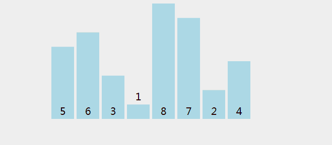
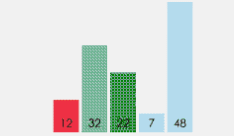
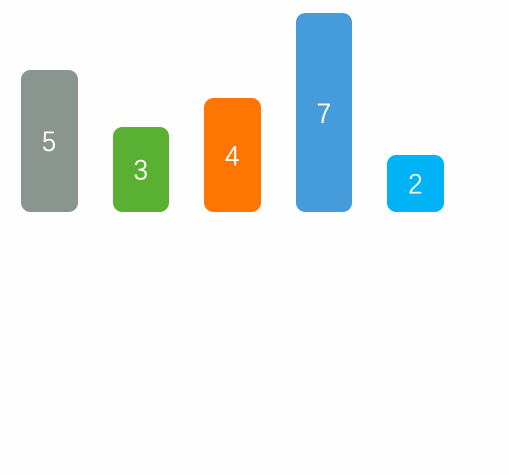

# 基本排序算法

### 冒泡排序(n**2)

进行n-1轮迭代，每次比较相邻的两个元素，如果前者大于后者，则交换顺序。因为直接在元素上进行操作，所以不会返回新的数组。其实就是每一轮冒泡，一个最大的元素就会通过比较相邻的元素，移到最右边。

你可以想象一个，10个小朋友站一排，身高并一，现在老师喊，从第一个小朋友开始，两两比较，

个子高的往右移（老师想让他们从低到高排序），第一轮就有一个小朋友最高的小朋友站到最右边，

第二轮次高的小朋友站倒数第二个位置，一直到最后一轮，一个小朋友不用比较，所以是n-1轮（9轮）



```python
def bubble_sort(seq):
    '''冒泡排序'''
    n = len(seq)

    for i in range(n-1):
        for j in range(n-1-i):
            if seq[j] > seq[j+1]:
                seq[j], seq[j+1] = seq[j+1], seq[j]


def test_bubble_sort():
    import random
    seq = list(range(10))
    random.shuffle(seq)

    seq_sort = sorted(seq)
    bubble_sort(seq)
    assert seq_sort == seq
```

### 选择排序(n**2)

冒泡排序的思路是两两比较，较大的指移到了最后边，选择排序则是两两比较，选择一个最小的放在第一个位置，

再从剩下的元素中选择一个最小的放在第二个位置，一直到剩下的元素只有一个元素，也是n-1轮。

同样的，10个小朋友站成一排，第一轮从10个小朋友中选择一个最矮的放在第一个位置，第二轮从剩下的9个小朋友中，再选择一个最矮的放在第二个位置，一直到只剩下最后一个小朋友，直接站在最后一个位置，也是n-1轮。

和冒泡排序一样，也是两两交换。



```python
def select_sort(seq):
    '''选择排序'''
    n = len(seq)

    for i in range(n-1):
        for j in range(i+1, n):
            if seq[j] < seq[i]:
                seq[i], seq[j] = seq[j], seq[i]


def test_select_sort():
    import random
    seq = list(range(10))

    random.shuffle(seq)
    seq_sort = sorted(seq)
    select_sort(seq)
    assert seq_sort == seq
```

### 插入排序(n**2)

如果有一个有序的序列，要求在这个已经排好序的序列中插入一个数，要求插入后仍然有序。因为是在有序的基础上再排序，利用了之前的有序条件，所以是稳定排序。

扑克牌摸牌，第一张摸到手里后，因为手里只有一张牌，认为是有序的，摸第二张的时候，这张牌和第一张比较，

没他大就交换位置，摸第三张牌的时候，和第二张牌比较，没他大就交换位置，否则一直找到比他小的，交换位

置。到最后一张牌也找到合适的位置后排好序了。



```python
def insert_sort(seq):
    n = len(seq)

    for i in range(1, n):
        target = seq[i]
        pos = i - 1
        while 0 <= pos and target < seq[pos]:
            seq[pos+1] = seq[pos]
            pos -= 1
        seq[pos+1] = target


def test_insert_sort():
    import random
    seq = list(range(10))
    random.shuffle(seq)

    seq_sort = sorted(seq)
    insert_sort(seq)
    assert seq_sort == seq
```

### 希尔排序


1959年Shell发明，第一个突破O(n2)的排序算法，是简单插入排序的改进版。它与插入排序的不同之处在于，它会优先比较距离较远的元素。希尔排序又叫**缩小增量排序**。

希尔排序属于插入类排序,是将整个有序序列分割成若干小的子序列分别进行插入排序。

```python
def shell_sort(seq):
    n = len(seq)

    interval = n // 2  # 不断缩小增量，每次是原来的一半
    while 0 < interval < n:
        # 里面是一个插入排序
        for i in range(1, n):
            target = seq[i]
            pos = i - interval
            while 0 <= pos and target < seq[pos]:
                seq[pos+interval] = seq[pos]
                pos -= interval
            seq[pos+interval] = target
        interval //= 2


def test_insert_sort():
    import random
    seq = list(range(10))
    random.shuffle(seq)

    seq_sort = sorted(seq)
    shell_sort(seq)
    assert seq_sort == seq
```

