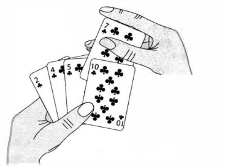

### 算法介绍

我们首先介绍插入排序， 对于少量元素的排序． 它是一个打效的箕法． 插入排序的工作方式 像许多人排序 一 手扑克牌． 开始时．我们的左手为空并且桌子上的牌面向下． 然后．我们每次从 桌子上拿走 一 张牌井将它插入左手中正确的位置． 为了找到 一 张牌的正确位置，我们从右到左将它与 已在手中的每张牌进行比较，如下图所示． 拿在 左手上的牌总是排序好的．原来这些牌是桌子上牌 堆中顶部的牌． 



```python
def insert_sort(seq):

	for j in range(len(seq)):
		key = seq[j]
		i = j - 1

		while i >= 0 and seq[i] > key:
			seq[i + 1] = seq[i]
			i -= 1

		seq[i+1] = key


def test_insert_sort():
	import random
	seq = list(range(10))
	random.shuffle(seq)

	insert_sort(seq)
	assert(seq==sorted(seq))
```

### 循环不变式与插入排序的正确性 
循环不变式主耍用来帮助我们理解算法的正确性．  
关于循环不变式，我们必须证明三条性质  

- 初始化: 循环的第一次达代之前,它为真． 
- 保持: 如果循环的某次迭代之前它为真． 那么下次迭代之前它仍为真． 
- 终止: 在循环终止时，不变式为我们提供一个有用的性质，该性质有助于证明算法是正确的．

当前两条性质成立时．在循环的每次迭代之前循环不变式为真．（当然，为了证明循环不变式在每次达代之前保持为真．我们完全可以使用不同于循环不变式本身的其他已证实的事实．）注意，这类似于数学归纳法， 其中为了研明某条性质成立，需耍证明一个基本情况和一个归纳步．这里．证明第一次迭代之前不变式成立对应于基本情况．证明从一次迭代到下一次迭代不变式成立对应于归纳步． 

第三条性质也许是最重要的． 因为我们将使用循环不变式来证明正确性． 通常，我们和导致循环终止的条件一起使用循环不变式．终止性不同于我们通常使用数学归纳法的做法， 在归纳法中， 归纳步是无限地使用， 在这里当循环终止时，停止“归纳”. 

#### 让我们行行对于插人排序， 如何证明这些性质成立．
- **初始化**: 首先证明在第一次循环迭代之前（当j=2时）， 循环不变式成立．所以子数组 A[1..j-1]仅由单个元素A[1]组成，实际上就是A[1]中原来的元素． 而且该子数组是排序好的 
这表明第一次循环迭代之前循环不变式成立． 
- **保持**: 其次处理第二条性质证明每次迭代保持循环不变式．将A[j-1].A[j-2]、 A[j-3]等向右移动一个位置，直到找到A[j]的适当位置，将A[j]的值插人该位置。 这时子数组A[1..n]由原来在A[1..n]中的元素组成．但已按序排列． 
那么对for循环的下一次迭代增加j将保持循环不变式． 
- **终止**：最后研究在循环终止时发生了什么． 导致for循环终止的条件是j>A.length=n。 因为每次循环迭代j增加1, 那么必有j=n+1. 在循环不变式的表述中将j用n+1代替．我们有子数组A[l..n]由原来在A[1..n]中的元索组成． 但已按序排列． 注意到． 子数组A[1..n]就是整个数组．我们推断出整个数组已排序．因此算法正确． 

### 考虑以下查找问题
1. 
	输入: n个数的 一 个序列A=(a,.a., ... , a,)和 一 个值v.    
	输出: 下标，使得v~A[,]或者当v不在A中出现时• V为特殊值NIL.    
	写出线性查找的伪代码，它扫描整个序列来查找v. 使用一个循环不变式来证明你的算法 是正确的． 确保你的循环不变式满足三条必要的性质． 
	```
	for i=1 to A.length
		if A[i] == v
			return i	
	return NULL
	```

	- 循环不变式：对于每次循环迭代，子数组（已遍历的元素）中没有与v相等的值。   
	- 初始化：第一次循环之前，i = 1，子数组没有元素，其中肯定没有与v相等的值，循环不变式成立。   
	- 保持：每次迭代都将比较A[i]与v的值，如果相等，循环终止；如果不等，A[1…i]中没有与v相等的值，循环不变式保持。   
	- 终止：当i > A.length 时或者A[i] == v 时循环终止。显然对于子数组即下标小于i的所有元素均没有与v相等的值，算法正确。   

2. 考虑把两个n位二进制整数加起来的问题．这两个整数分别存储在两个n元数组A和B中．
	这两个整数的和应按二进制形式存储在一个(n+1)元数组C中． 请给出该问题的形式化描述， 井写出伪代码．
	```
		carry = 0
		for i=1 to n
			C[i] = (A[i] + B[i]) // 2 + carry
			carry = (A[i] + B[i]) % 2
		C[i+1] = carry
	```
	C[i] = (A[i] + B[i]) // 2 + (A[i-1] + B[i-1]) % 2

	C[i+1] = (A[i+1] + B[i+1]) // 2 + (A[i] + B[i]) % 2

